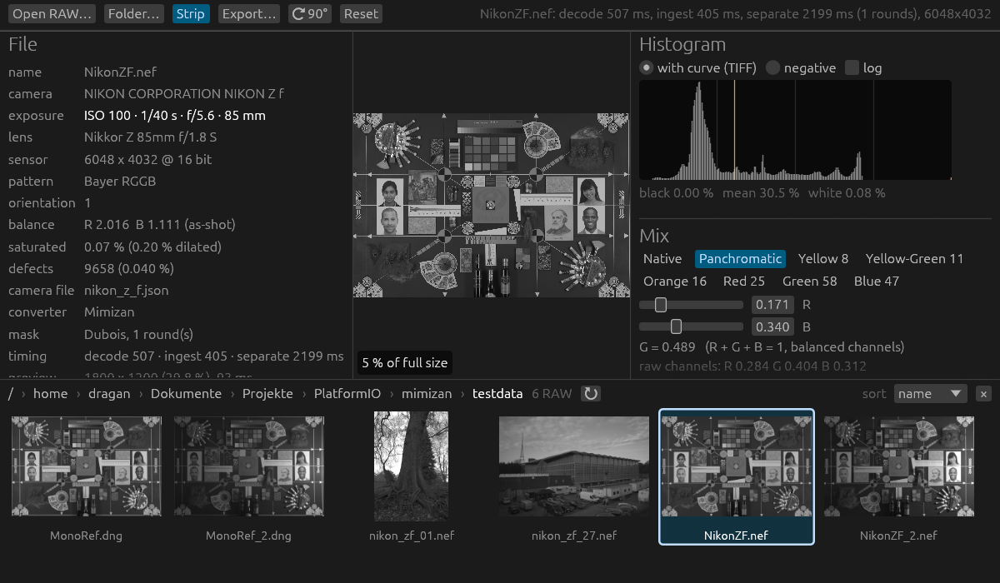

# Mimizan Lab

Linear monochrome negatives straight from Bayer RAW: no demosaicing, no
hidden tone curve, every step measured. **Experimental.**

A colour sensor records luminance and chrominance in one mosaic. Mimizan Lab
estimates the luminance `L` directly from that mosaic (Alleysson/Dubois
frequency separation) and writes a 16-bit linear negative plus a print path
(size, curve, USM). Everything is `f64`, deterministic, and measured on
synthetic scenes with known ground truth and, since the Kodak benchmark
below, against the demosaicers it competes with.

The name: the idea came up on the beach at Mimizan on the Atlantic coast,
watching the surf. Fittingly, the method is about separating waves, the
chroma carriers riding on the Bayer mosaic from the luminance underneath.
*Lab* is the darkroom: the program develops negatives, nothing else.

## What it is for

Mimizan Lab was built to make the best monochrome negative the measurements
support from a Nikon Z f RAW. The way there does not demosaic. Luminance is
separated straight from the mosaic. On pictures a lens can take, that
unconventional path lands among the strongest demosaicers, and with
`--reconstruct` it has the highest mean of the photographic tests.

AMaZE, RCD, DCB and LMMSE are in the desktop app beside it, so anyone can
switch and see the difference, not only read a table. They are there so
Mimizan can be compared. The separation stays the default and is unchanged.

The program is a gift to the community: GPL-3.0-or-later, free to use and
to check.

The published limit remains. On the pixel-sharp test the literature uses,
LMMSE leads. Against a real monochrome sensor the curves match through
0.30 c/px, and the last octave stays open. For the Z f negative, shot the
way these files were shot, the aim is met. The numbers are under
[Where it stands](#where-it-stands).



Documents: [`docs/SPEC.md`](docs/SPEC.md) (the contract: every formula and
default, German), [`docs/RESULTS.md`](docs/RESULTS.md) (measurements per
phase), [`docs/KODAK.md`](docs/KODAK.md), [`docs/KODAK_2X.md`](docs/KODAK_2X.md),
[`docs/KODAK_LENS.md`](docs/KODAK_LENS.md), [`docs/KODAK_ZF.md`](docs/KODAK_ZF.md)
and [`docs/KODAK_ZF_SOFT.md`](docs/KODAK_ZF_SOFT.md) (benchmark against
demosaicers in five conditions),
[`docs/whitepaper_v1.pdf`](docs/whitepaper_v1.pdf) (the original idea).
The same three Kodak conditions against every standalone demosaicer in
libraw and RawTherapee 5.11 are in
[`docs/KODAK_FIELD_SHARP.md`](docs/KODAK_FIELD_SHARP.md),
[`docs/KODAK_FIELD_LENS.md`](docs/KODAK_FIELD_LENS.md) and
[`docs/KODAK_FIELD_2X.md`](docs/KODAK_FIELD_2X.md).

## Where it stands

Read this before the feature list.

**The claim: the strongest interpolation-free monochrome conversion of a
Bayer mosaic we have measured, once the picture is one a lens can take.**
Interpolation-free is in the code: every output pixel is a weighted sum of
measured values, the weights are written into the negative's description,
and a wrong result is a periodic carrier residue, never plausible detail
that was not in the scene. The field below is every standalone demosaicer
libraw and RawTherapee 5.11 implement (17 of them, plus bilinear). Dual
blends and learned demosaicers were not run. On band-limited Kodak content
the linear default leads that field, 50.80 dB, +1.67 dB over DCB, and is
at or above the best demosaicer on 21 of 24 pictures. On lens-like content
it sits in the leading group, 50.21 dB, 1.26 dB behind DCB. On the
pixel-sharp literature test, which is not a photograph, it trails, 36.55 dB
against LMMSE at 43.09. The same limit shows against a real monochrome
sensor (`docs/RESULTS.md`, "Z f negative against the reference camera":
93–104 % of its MTF up to 0.30 c/px, 3.6 % rms on the ColorChecker, 37–80 %
of that sensor at 0.5 c/px).

**The checkbox: `--reconstruct` (GUI: "reconstruct the last octave",
default off) is the highest mean in both photographic conditions, and
second on the table everyone else publishes.** Lens-like 51.93 dB,
band-limited 51.96 dB. On lens-like pictures DCB is still the best single
method on 12 of 24 and reconstruct on 9; the mean lead over DCB is +0.46 dB,
and against whichever method wins that picture the lead shrinks to about
+0.05 dB. On band-limited pictures reconstruct wins 22 and the linear
default the other 2. On pixel-sharp content it is second, 42.04 dB against
LMMSE 43.09, two pictures of 24, and it computed 49 % of those frames. On
a photograph it computes 12 % (lens-like) or 5 % (band-limited). Two
band-limited pictures get slightly worse (kodim10 −0.41 dB, kodim24
−0.72 dB). The price is in the name of the checkbox: where the linear
luminance still carries energy near the carriers, a per-pixel direction
decision on interpolated colour differences replaces the filter output, so
those pixels are computed, not measured. The step is accounted for: the
sidecar records per pixel how much (204 = measured … 252 = computed), the
negative's description carries the share of the picture it took over, and
the linear path is untouched (off, the result is bit-identical to 0.3.0).

The estimator is measured against that field on the 24 Kodak pictures,
turned into Bayer mosaics and reduced to the same luminance
`(R + 2G + B)/4`. **On content as a lens and sensor deliver it, the linear
default leads when the content is band-limited and stays inside the leading
group when a lens-like MTF still reaches Nyquist; with `--reconstruct` the
mean leads both. On pixel-sharp content, the convention of the demosaicing
literature, LMMSE leads and the linear default trails by 6.5 dB.** The two
real Nikon Z f rows further down are still the earlier five-method set
(AHD, DHT, AMaZE, RCD, bilinear), not this wider field.

| Condition | Bilinear | AHD | DHT | AMaZE | RCD | Mimizan | Mimizan + reconstruct (computed) |
|---|---|---|---|---|---|---|---|
| pixel-sharp (Kodak as is) | 32.6 | 38.7 | 38.3 | 40.7 | 38.5 | 36.6 | **42.0** (49 %) |
| lens-like (Kodak, Gaussian σ 0.75, MTF50 at 0.25 c/px) | 41.2 | 48.6 | 48.0 | 50.5 | 50.6 | 50.2 | **51.9** (12 %) |
| band-limited (Kodak 2× magnified) | 39.9 | 47.6 | 44.8 | 48.0 | 48.9 | 50.8 | **52.0** (5 %) |
| real Nikon Z f RAWs, 2×2-binned ground truth (4 files) | 37.3 | 41.6 | 41.1 | 42.1 | **42.8** | 40.4 | 41.7 (10 %) |
| real Nikon Z f RAWs, binned then 2× magnified (4 files) | 45.7 | 48.3 | 46.6 | 48.6 | 50.7 | **51.9** | 51.9 (0.5 %) |

Mean luminance PSNR in dB, 16 px border excluded; bold is the best value
in that row of this five-method table (LMMSE, absent here, leads the
pixel-sharp row of the full field below; DCB leads the lens-like row among
methods other than reconstruct). "computed" is the share of the picture
the reconstruction step took over; tables per picture, SSIM and crops in
`docs/KODAK.md`, `docs/KODAK_LENS.md`, `docs/KODAK_2X.md`,
`docs/KODAK_ZF.md`, `docs/KODAK_ZF_SOFT.md`; reproduce with `mimizan bench
kodak` (`--blur 0.75`, `--scale 2`, `--raw file.nef`, `--raw file.nef
--scale 2`; needs `libraw-bin` and `rawtherapee`). The two real-file rows
use no synthetic picture at all: every 2×2 cell of the real mosaic is
binned to one measured RGB pixel, that half-size picture is the truth and
is mosaicked again, with the real lens, real noise and the camera's noise
model. Relative to its grid that content is twice as sharp as the camera
saw it (fourth row); magnified back to the camera's pixel count (fifth row)
it has the camera's own band limit. The lens-like row is the most honest
synthetic condition: content up to Nyquist, attenuated as a lens and the
pixel aperture attenuate it, instead of either stopping at half of it or
jumping within one pixel.

### The whole classical field

Same three Kodak conditions, every standalone demosaicer in libraw and
RawTherapee 5.11, run on all 24 pictures in this repository's bench.
RawTherapee uses one neutral profile per method (no sharpening, no noise
reduction, camera channels as recorded) with that method's own defaults:
DCB two iterations and enhance, LMMSE two iterations. Dual blends
(AMaZE+VNG4 and the like) are mixtures of entries already in the list and
were left out. Sorted by the lens-like mean, the photographic ranking.
Bold is the best mean in that column.

| Method | pixel-sharp | lens-like | band-limited |
|---|---|---|---|
| Mimizan + reconstruct | 42.04 | **51.93** | **51.96** |
| DCB (RawTherapee) | 39.79 | 51.47 | 49.13 |
| RCD | 38.48 | 50.59 | 48.88 |
| AMaZE | 40.72 | 50.50 | 47.99 |
| Mimizan | 36.55 | 50.21 | 50.80 |
| LMMSE | **43.09** | 49.85 | 47.91 |
| AAHD | 38.57 | 49.16 | 46.36 |
| AHD (libraw) | 38.71 | 48.60 | 47.61 |
| EAHD | 38.88 | 48.58 | 47.09 |
| AHD (RawTherapee) | 38.72 | 48.57 | 47.08 |
| PPG | 37.67 | 48.28 | 47.79 |
| DHT | 38.30 | 48.00 | 44.81 |
| HPHD | 40.00 | 47.93 | 46.08 |
| fast | 36.77 | 46.68 | 45.63 |
| DCB (libraw) | 36.16 | 46.53 | 45.86 |
| VNG | 37.63 | 46.26 | 45.01 |
| IGV | 40.27 | 45.62 | 44.55 |
| VNG4 | 35.83 | 45.03 | 44.37 |
| Mimizan fixed | 34.60 | 43.95 | 44.02 |
| Mimizan block mask | 34.56 | 43.07 | 42.54 |
| Bilinear | 32.61 | 41.23 | 39.94 |

Mean luminance PSNR, dB. Reconstruct's computed share is 49.4 % / 12.0 % /
5.1 %. SSIM means, same order of conditions: LMMSE 0.9906, reconstruct
0.9879, linear 0.9747 on pixel-sharp; reconstruct 0.9982, DCB 0.9979,
linear 0.9978 on lens-like; reconstruct 0.9991, linear 0.9990 on
band-limited. Per picture, SSIM and the hardest-window crops:
`docs/KODAK_FIELD_SHARP.md`, `docs/KODAK_FIELD_LENS.md`,
`docs/KODAK_FIELD_2X.md`.

What that is, in one paragraph. For a photograph the linear pipeline, which
estimates no pixel, is as good as the usual demosaicers and on band-limited
content better than all of them. Reconstruct is worth turning on when the
picture is sharp out to the sensor; on a soft picture the detector finds
almost nothing. The published Kodak tables are the pixel-sharp column, and
there LMMSE is the best demosaicer we measured. The result to keep is the
other two columns: a conversion that stays a weighted sum of measurements
until the last octave, and only then estimates, leads the mean of every
classical method once the picture is one a lens can form.

These are the numbers of the current default (`--mask dubois`). The first
version of this bench, with the fixed estimator and the block-spectrum
mask, was 4–6 dB behind on every picture and at the bilinear level on the
real files (34.6 / 44.0 / 33.9 dB). Taking the estimator apart found three
defects, none of them in the benchmark (`docs/RESULTS.md`, last section):
the two copies of the `C2` chroma were averaged although luminance leaks
into only one of them at a time; the block mask decides from an energy
ratio that a line pattern inside the band satisfies like chroma, so it
could not protect the resolution charts it was built for; and square pass
bands wasted the chroma bandwidth along the carriers. The replacement
weights the two copies per pixel by their local energy (Dubois 2005) and
blends two direction-dependent `C1` bands with the same weight (0.2.0:
+1.9 / +5.3 / +2.8 dB on the first three conditions). On top of that, the
bands are opened per pixel where the two copies agree in the ring between
the narrow and the wide band: chroma is in both copies, a luminance leak
in one only, so a coherent ring is chroma and may be let through (0.3.0:
+0.1 pixel-sharp, +1.5 band-limited, +3.8 dB on the real files at the
camera's pixel count; no picture got worse by more than 0.06 dB). The
price is time and memory: 3.3 s instead of 2.2 s for 24 MP and ten planes
instead of six.


*kodim19, band-limited condition: sensor mosaic · best demosaicer reduced to
mono · Mimizan · ground truth, the window with the largest combined error of
both estimates.*

What the linear default cannot do, and what the remaining gap is made of:
chroma beyond the pass band at sharp coloured edges (one-pixel colour
transitions, which the pixel-sharp condition is full of and a lens does
not produce), and achromatic line patterns near Nyquist that contaminate
both chroma copies at once (the resolution charts in the Z f scene). A
linear pass-band estimator cannot separate either; the demosaicers get
them with nonlinear decisions (homogeneity selection, median filtering of
colour differences). Where the linear path fails, the failure is a
periodic carrier residue, never plausible detail that was not in the
scene; that makes the result predictable, it does not make it closer to
the truth, and it is not more "analogue" (a Nyquist checkerboard is the
opposite of film grain).

The reconstruction step (`--reconstruct`) is the nonlinear answer
for exactly those two cases, kept out of the default: directional
colour-difference estimates along rows and columns, fused per pixel by
their local error variances (Zhang & Wu 2005), computed on `m^(1/2.2)`
because colour differences are nearly constant across an edge in a
compressed domain and far from it in linear light (that choice alone is
worth 5 dB on pixel-sharp content), and applied only where the linear
luminance still carries energy near the carriers above the noise. On
content at the camera's own band limit the detector finds nothing (0.5 %
of the picture) and the result is the linear one; on pixel-sharp content
it takes half the picture and 5.5 dB. Where it is wrong, it is wrong the
way demosaicers are: a zipper or a smeared line, not a residue. The real
files at twice the camera's sharpness are the one condition where it
remains behind RCD (−1.1 dB; with the step forced everywhere the gap is
the same, so there the estimator, not the detector, is the limit).
`docs/RESULTS.md`, "Reconstruct", has the sweep and the negative results.

### Roadmap

1. Real-file acceptance: more cameras and scenes through `bench kodak
   --raw`; four Z f files from two scenes are a start, not a sample.
2. The reconstruction estimator on real noise: it is 1 dB behind RCD on
   the binned Z f files whatever the detector does.
3. The same full field on real files. The Kodak synthetic comparison above
   is that field; the two Z f rows are still five methods. No claim about
   reconstruction on real noise beyond those four files until that run
   exists.

## What you get

| binary          | purpose |
|-----------------|---------|
| `mimizan`      | CLI: `info`, `dump`, `negative`, `print`, `calibrate`, `synth`, `measure`, `bench` |
| `mimizan-gui`  | Desktop app: open a RAW, judge mix and look interactively, export TIFF + screen JPEG. Converter: Mimizan (default), or AMaZE, RCD, DCB, LMMSE |

Supported input: Bayer RAWs that [rawler](https://crates.io/crates/rawler)
decodes (verified: Nikon Z f NEF). Monochrome sensors (DNG without a colour
filter array) pass through without separation. Not supported by design:
X-Trans, Quad-Bayer, Foveon, Nikon HE/HE* NEF.

Output: 16-bit grey TIFF, linear (negative, with a grey ICC profile and a
JSON description of every parameter) or gamma 2.2 (print), plus an 8-bit
`.mask.tif` sidecar and an optional JPEG proof.

What it is not: not a RAW converter, no colour output, no noise reduction,
no lens corrections.

## Install

Prebuilt packages are on the
[releases page](https://github.com/Draganito/mimizan/releases):
`mimizan_<version>_amd64.deb` (Debian/Ubuntu, both binaries, camera and look
files, docs) and `mimizan-<version>-x86_64-linux.tar.gz`.

```bash
sudo apt install ./mimizan_0.5.0-1_amd64.deb
mimizan --version
```

From source (Rust 1.95 or newer, no system libraries needed beyond a working
OpenGL for the GUI):

```bash
git clone https://github.com/Draganito/mimizan
cd mimizan
cargo build --release
./target/release/mimizan --help
./target/release/mimizan-gui
```

Under GNOME Wayland the window frame (title, minimise/maximise/close) is
drawn by the application (`sctk-adwaita`); which buttons appear follows the
GNOME setting `org.gnome.desktop.wm.preferences button-layout`. Other
desktops and X11 draw their native frame.

## Quick start

```bash
# What is in the file?
mimizan info photo.nef

# RAW -> linear negative (as-shot channel balance; --mask dubois is the
# default, --mask off the fixed estimator, --mask adaptive the block mask;
# --reconstruct adds the nonlinear step for the last octave, see "Where it stands")
mimizan negative photo.nef -o photo_neg.tif
#   writes photo_neg.tif (16 bit linear) and photo_neg.mask.tif

# Negative -> print file, 30x40 cm at 300 dpi, neutral look, mild USM, JPEG proof
mimizan print photo_neg.tif -o photo_print.tif --size 30x40cm --usm-amount 0.5 --proof photo_print.jpg

# Negative -> JPEG for the web, 2048 px long edge, exact screen compensation instead of USM
mimizan print photo_neg.tif -o photo_2048.jpg --size 2048px --screen 1.0 --look look/reference.json

# Richardson-Lucy instead of a halo: 5 passes invert a Gaussian of the USM radius on every pixel
mimizan print photo_neg.tif -o photo_print.tif --size 30x40cm --deconv 5

# The benchmark of the section above (writes docs/KODAK.md and docs/kodak/*.png)
mimizan bench kodak --images testdata/kodak
mimizan bench kodak --images testdata/kodak --scale 2 --report docs/KODAK_2X.md --strips docs/kodak2x --out out/kodak2x
mimizan bench kodak --images testdata/kodak --blur 0.75 --report docs/KODAK_LENS.md --strips docs/kodak_lens --out out/kodak_lens
mimizan bench kodak --raw testdata/*.nef --report docs/KODAK_ZF.md --strips docs/kodak_zf --out out/zf
mimizan bench kodak --raw testdata/*.nef --scale 2 --report docs/KODAK_ZF_SOFT.md --strips docs/kodak_zf_soft --out out/zf_soft
```

`--screen` is not a taste setting. For an image shown pixel-for-pixel on a
screen the losses are known: the Lanczos-3 downscale and the display's pixel
aperture (sinc). Mimizan Lab inverts their product with a 9-tap FIR designed by
least squares against the Wiener inverse (gain capped at 2× near Nyquist),
so the result is neither over- nor under-sharpened for a 1:1 view; `1.0` is
the full compensation, less leaves part of the loss in. What it cannot know
is a browser that rescales the image itself (SPEC §9).

`--deconv N` is the other way to sharpen a print: Richardson–Lucy with a
Gaussian PSF of the USM radius, N passes (1..10), on every pixel, no mask. It
undoes blur instead of drawing a halo around it, and it brings back the
noise the blur had hidden; the PSF is an assumption, not a measurement, so
this is sharpening by inversion, not restoration (SPEC §9). USM may follow it.

`mimizan negative` picks `cameras/<make>_<model>.json` by the camera in the
file (noise model, default mix weights, default USM amount). Without a camera
file the defaults from the SPEC apply. `--weights r,g,b` (sum 1) changes the
colour-filter mix: `0.25,0.5,0.25` is exactly the Bayer luminance; other
weights add low-pass chrominance, never a demosaic. Weights live in one of
two spaces (`--weights-space`): `balanced` acts after white balance and is
what the mix formula uses; `raw` acts on the sensor channels as recorded,
which is how a monochrome sensor's fixed spectral response behaves and is
what the camera file stores after a fit. Raw weights are converted per
image with the as-shot multipliers (`w_bal ∝ w_raw / wb`), so the same
camera file gives the right mix under daylight and tungsten.

`--filter yellow-8 | yellow-green-11 | orange-16 | red-25 | green-58 |
blue-47` (or just the number) puts a classic contrast filter in front of
the mix: the base weights are multiplied by the filter's channel
transmissions and renormalised (`w'_c = w_c T_c / Σ w_j T_j`), so a filter
is only another weight triple and changes nothing else in the pipeline.
The transmissions are approximations of typical filter curves, not
measured fits; they give each filter's character (sky, foliage, skin), not
the curve of one particular glass. Measured on the Z f: resolution and
grain are unchanged by any weighting (fine detail comes from `L̂` alone);
a filter adds only band-limited chroma noise, 19–21 % σ on smooth areas
for the red filter, far less for yellow or orange.

The GUI is deliberately small: open or drop a RAW, choose the mix from one
row of presets (*Native*, *Panchromatic* = the camera file's calibrated
weights, and the filters *Yellow 8* … *Blue 47* in front of it) or move
the R/B sliders freely, pick a look (`neutral`, `reference`, or draw a
custom curve), turn the picture in 90° steps if the camera's orientation
tag is wrong (`⟳ 90°`), press *Export*. Every export writes two files with
the current mix and look: `<name>.tif` (16 bit, full resolution, gamma 2.2
grey ICC, unsharpened: the file to continue with in an editor) and
`<name>_2048px.jpg` (2048 px long edge, quality 100, one channel, the
screen compensation above). There is no print or export panel: paper size,
dpi and viewing-distance sharpening belong to the editor that prints; the
CLI keeps them (`mimizan print --size 30x40cm --usm-amount …`). The preview
is never sharpened: it shows the negative as the TIFF gets it, and once you
zoom past the fit-to-window preview (scroll, `1:1`, or a double click) the
visible window is rendered from the full-resolution separation, pixel for
pixel, so the negative can be judged, carrier residue included. The left
column shows the file's exposure (ISO, time, aperture, focal length, lens)
from EXIF. The *Development* fold defaults to Mimizan with the Dubois
separation (`mask: Dubois`); the fixed estimator, the block mask and
reconstruction stay one click away. The same fold can switch to AMaZE, RCD,
DCB or LMMSE. That recomputes the picture at once and leaves the Mimizan
path untouched; weights, filters and the look apply to either. A
histogram (256 bins, linear or log) is computed from the full-resolution
negative, never from the preview copy: either after the look curve (what the
TIFF gets) or the linear mix on a gamma-2.2 axis. The black/white readout
counts the pixels that are 0 or 65535 in the 16-bit output, i.e. the TIFF's
own clipping. Exports run in a background thread; the preview (a downscaled
copy of the separation) updates in milliseconds. `Reset` returns the
controls to the camera-file defaults and keeps the negative.

## Calibration

The pipeline has no hidden tuning; the three things that depend on the camera
are fitted from test charts and written into `cameras/*.json` and
`look/*.json`:

```bash
# Look curve from a grey wedge (negative patches vs. a reference JPEG)
mimizan calibrate wedge neg.tif --reference ref.jpg --grid x,y,w,h,cols,rows --name reference --out look/reference.json

# Mix weights from colour patches (RAW patch means vs. reference brightness);
# written to the camera file in raw-channel space
mimizan calibrate weights photo.nef --reference ref.jpg --grid ... --write

# Siemens star MTF (--spokes = number of cycles of the star)
mimizan calibrate star neg.tif --center x,y --radius rmin,rmax --spokes 45 --write
```

`wedge` and `weights` have a `--self-test` on synthetic data (see RESULTS.md).
Both shipped files are real fits against a full-frame monochrome camera (a
sensor without colour filter array, called the reference camera below):
`look/reference.json` maps the reference camera's linear DNG onto its own
out-of-camera JPEG over a Kodak grey scale, and the weights in
`cameras/nikon_z_f.json` (raw channels 0.284, 0.404, 0.312, RMSE 2.2 %) make
the Z f mix match the reference camera's spectral response on a ColorChecker
shot in the same scene. On a second pair under tungsten the raw-space
weights hold to 8 % (the balanced-space form would be off by 16 %);
the Z f negative reaches 93–104 % of the reference camera's MTF up to
0.30 c/px and 80–91 % at MTF10, depending on the lens pair (`docs/RESULTS.md`,
"Z f negative against the reference camera"). The noise model still carries
defaults.

## Measuring instead of looking

```bash
mimizan synth --scene star -o /tmp/star          # mosaic + ground truth, any CFA phase (--phase)
mimizan measure synth                             # synthetic bench: RMSE, MTF50/10, carrier energy, wedge slope
mimizan measure diff a.tif b.tif                  # regression check: identical / max / RMS steps
mimizan bench kodak --images testdata/kodak       # against libraw / RawTherapee demosaicers, PSNR + SSIM + crops
```

The synthetic bench compares against a bilinear baseline, which is a floor,
not a competitor; the Kodak bench is the comparison that counts. Acceptance
thresholds and the current numbers are in `docs/RESULTS.md`. The Kodak
pictures are not in the repository (`testdata/README.md` says where to get
them); the generated reports and crops are.

## Performance

Nikon Z f (24.4 MP), Ryzen 7 5700U, 16 threads: RAW to negative on disk in
3.3 s with the default separation (budget was 3 s; the coherence step costs
1.1 s, `--mask off` runs in 2.2 s); 45 MP extrapolates to about 6 s. Peak
memory is ten full `f64` planes in the default path (2.0 GB at 24 MP), six
in the fixed and block-mask paths; `--reconstruct` adds 2.2 s and four
planes. Output is bit-identical between runs and between thread counts.

## Repository layout

```
crates/mimizan-core   decode, ingest, separate, dubois, mask, reconstruct, mix, resize, curve, usm, print, calibrate, synth, metrics, kodak
crates/mimizan-cli    the `mimizan` binary (clap)
crates/mimizan-gui    the `mimizan-gui` binary (egui/eframe); links mimizan-demosaic
crates/mimizan-demosaic  AMaZE, RCD, DCB, LMMSE via librtprocess (GPL-3.0-or-later)
third_party/librtprocess  vendored RawTherapee demosaic library
cameras/               per-camera JSON (noise, weights, USM, star MTF)
look/                  look curves (PCHIP points over gamma-2.2 encoded values)
docs/                  SPEC.md, RESULTS.md, KODAK*.md + kodak*/ (benchmark reports and crops), whitepaper, screenshot
dist/                  release packaging (cargo-deb + tarball)
testdata/              RAW samples and Kodak pictures, not in git (see testdata/README.md)
```

Development: `cargo fmt`, `cargo clippy --release --all-targets` (warnings are
errors in CI), `cargo test --release` (unit, property and determinism tests),
`cargo bench -p mimizan-core` (criterion).

## Status and limits

- Phases 0–7 of the plan are implemented; deviations from the whitepaper are
  marked **[Abweichung]** in the SPEC with their reason.
- Reconstruction quality: see "Where it stands". The numbers there are the
  current state, not a target.
- Reference look, Z f mix weights and star MTF are measured; the noise model
  still carries defaults.
- Wayland: when the GUI window is fully covered or opened behind the focused
  window, the compositor pauses it; a running export still finishes, the log
  line appears once the window is visible again.

## License

Copyright (C) 2026 Dragan Bojovic.

Mimizan Lab is free software under the GNU General Public License, version 3
or any later version. See [LICENSE](LICENSE). The already published release
0.4.0 stays under the MIT license it was shipped with. This change applies
from here on.

AMaZE, RCD, DCB and LMMSE come from
[librtprocess](https://github.com/CarVac/librtprocess) (GPL-3.0-or-later,
vendored in `third_party/librtprocess`). They sit beside the separation:
Mimizan remains the default and that path is unchanged. Part of Dragan
Bojovic's analogue/digital darkroom tool line (LF Concept Camera *miluka*,
splitgrade controller, kicad-mcp).
