# Kodak fake-Bayer benchmark

Generated by `mimizan bench kodak`. The 24 Kodak PhotoCD pictures (768×512, 8-bit sRGB, film scans without CFA artefacts) are linearised, sampled through an RGGB Bayer pattern and quantised to 16 bit. **Condition: pixel-sharp**, the pictures as they are, the convention of the demosaicing literature (colour edges one pixel wide, which no lens delivers). The identical mosaic goes to Mimizan and, as a DNG, to the external demosaicers. Their RGB output is reduced with the same weights as the ground truth, `(R + 2G + B)/4` (Mimizan's `Native` mix), so every number measures reconstruction of the luminance only: no tone curve, no sharpening, no noise reduction anywhere.

Metrics on sRGB-encoded 8-bit-scale values, 16 px border excluded: PSNR in dB and SSIM (Gaussian 11×11, σ = 1.5). Higher is better. The mosaic reaches Mimizan with a noise model of the 8-bit quantisation only (`σ ≈ 2.2·10⁻³·√s + 10⁻⁴`), so the block mask treats film grain as signal.

Converters:

- `dcraw_emu`: dcraw_emu: almost complete dcraw emulator
- `rawtherapee-cli`: RawTherapee, version 5.11, command line.

libraw: `dcraw_emu -4 -o 0 -r 1 1 1 1 -c 0 -H 0 -q N` (linear 16-bit, camera channels, unit balance). RawTherapee: `rawtherapee-cli -n -b16 -p <neutral profile with the demosaicer>`, sRGB transfer curve inverted on read. Both were verified to return the source channels unchanged on a smooth picture (see `docs/RESULTS.md`).

## PSNR (dB, luminance)

| Picture | Bilinear | AHD (libraw) | DHT (libraw) | AMaZE (RawTherapee) | RCD (RawTherapee) | Mimizan fixed | Mimizan block mask | Mimizan | Mimizan + reconstruct | computed |
|---|---|---|---|---|---|---|---|---|---|---|
| kodim01 | 28.85 | 35.29 | 35.59 | 38.38 | 35.01 | 32.81 | 33.22 | 33.76 | **40.21** | 79.5 % |
| kodim02 | 36.19 | 40.08 | 38.89 | 35.55 | 36.80 | 32.90 | 32.86 | 37.64 | **42.04** | 32.7 % |
| kodim03 | 37.28 | 42.75 | 41.06 | 45.13 | 42.92 | 37.98 | 37.72 | 40.24 | 44.58 | 24.5 % |
| kodim04 | 36.13 | 40.05 | 39.15 | 41.37 | 40.36 | 34.01 | 33.79 | 38.85 | **41.55** | 28.6 % |
| kodim05 | 28.23 | 35.70 | 33.83 | 38.00 | 35.49 | 31.47 | 31.60 | 32.70 | **39.59** | 56.9 % |
| kodim06 | 30.60 | 37.37 | 37.52 | 40.46 | 37.12 | 33.79 | 34.40 | 35.29 | **41.86** | 65.7 % |
| kodim07 | 35.71 | 42.32 | 41.81 | 44.59 | 42.83 | 37.30 | 36.26 | 38.93 | **44.63** | 29.0 % |
| kodim08 | 25.90 | 34.74 | 34.24 | 37.32 | 34.32 | 28.34 | 28.19 | 31.63 | **38.78** | 83.1 % |
| kodim09 | 34.47 | 42.40 | 42.45 | 44.42 | 42.06 | 38.01 | 38.45 | 39.91 | **45.05** | 44.3 % |
| kodim10 | 34.86 | 42.56 | 42.22 | 44.57 | 41.87 | 39.52 | 40.30 | 40.67 | **44.98** | 43.2 % |
| kodim11 | 31.44 | 37.45 | 37.17 | 39.46 | 37.36 | 32.76 | 32.80 | 34.68 | **41.38** | 62.5 % |
| kodim12 | 36.13 | 43.25 | 43.80 | 45.70 | 42.94 | 39.39 | 38.33 | 41.05 | 45.61 | 46.0 % |
| kodim13 | 26.26 | 30.80 | 30.84 | 33.86 | 30.69 | 29.31 | 31.01 | 29.28 | **36.45** | 84.7 % |
| kodim14 | 31.45 | 36.68 | 35.82 | 38.79 | 37.09 | 31.67 | 31.75 | 34.13 | **40.01** | 62.7 % |
| kodim15 | 35.44 | 39.76 | 38.51 | 41.42 | 39.40 | 34.24 | 34.37 | 38.33 | **42.25** | 29.8 % |
| kodim16 | 34.20 | 41.86 | 41.70 | 44.54 | 41.04 | 37.35 | 37.24 | 40.13 | **45.56** | 50.9 % |
| kodim17 | 34.27 | 39.58 | 39.24 | 42.01 | 39.79 | 36.71 | 36.49 | 37.28 | **43.20** | 33.2 % |
| kodim18 | 30.56 | 34.97 | 34.90 | 37.29 | 35.18 | 32.51 | 32.39 | 33.57 | **39.45** | 55.2 % |
| kodim19 | 30.64 | 38.64 | 39.12 | 41.67 | 38.95 | 32.74 | 31.45 | 35.11 | **41.94** | 53.3 % |
| kodim20 | 33.47 | 40.07 | 39.79 | 42.76 | 40.11 | 36.43 | 36.32 | 37.44 | **43.41** | 35.7 % |
| kodim21 | 30.93 | 36.89 | 37.23 | 38.82 | 36.59 | 33.44 | 33.06 | 34.59 | **41.23** | 53.8 % |
| kodim22 | 33.15 | 37.92 | 38.53 | 40.22 | 38.31 | 34.98 | 35.19 | 36.50 | **40.99** | 52.3 % |
| kodim23 | 37.01 | 43.58 | 41.76 | 44.33 | 43.46 | 39.80 | 39.95 | 42.05 | **45.68** | 22.1 % |
| kodim24 | 29.40 | 34.32 | 34.08 | 36.59 | 33.78 | 32.94 | 32.34 | 33.42 | **38.54** | 56.6 % |
| **mean (24)** | **32.61** | **38.71** | **38.30** | **40.72** | **38.48** | 34.60 | 34.56 | **36.55** | **42.04** | 49.4 % |

Bold in the two Mimizan columns: at least as good as the best external demosaicer on that picture. "computed" is the share of the picture the reconstruction step took over (mean β).

## SSIM (luminance)

| Picture | Bilinear | AHD (libraw) | DHT (libraw) | AMaZE (RawTherapee) | RCD (RawTherapee) | Mimizan fixed | Mimizan block mask | Mimizan | Mimizan + reconstruct |
|---|---|---|---|---|---|---|---|---|---|
| kodim01 | 0.8937 | 0.9729 | 0.9760 | 0.9861 | 0.9689 | 0.9568 | 0.9619 | 0.9661 | 0.9888 |
| kodim02 | 0.9412 | 0.9729 | 0.9608 | 0.9555 | 0.9648 | 0.8914 | 0.8908 | 0.9571 | 0.9770 |
| kodim03 | 0.9648 | 0.9889 | 0.9822 | 0.9929 | 0.9884 | 0.9759 | 0.9732 | 0.9845 | 0.9906 |
| kodim04 | 0.9461 | 0.9752 | 0.9741 | 0.9825 | 0.9759 | 0.9391 | 0.9383 | 0.9701 | 0.9797 |
| kodim05 | 0.9248 | 0.9842 | 0.9812 | 0.9900 | 0.9827 | 0.9527 | 0.9491 | 0.9721 | 0.9899 |
| kodim06 | 0.9176 | 0.9829 | 0.9838 | 0.9905 | 0.9800 | 0.9674 | 0.9724 | 0.9769 | 0.9911 |
| kodim07 | 0.9749 | 0.9912 | 0.9907 | 0.9941 | 0.9919 | 0.9794 | 0.9765 | 0.9875 | 0.9931 |
| kodim08 | 0.9002 | 0.9800 | 0.9805 | 0.9878 | 0.9771 | 0.9451 | 0.9441 | 0.9687 | 0.9897 |
| kodim09 | 0.9576 | 0.9844 | 0.9860 | 0.9899 | 0.9834 | 0.9818 | 0.9846 | 0.9836 | 0.9886 |
| kodim10 | 0.9581 | 0.9867 | 0.9881 | 0.9913 | 0.9856 | 0.9832 | 0.9852 | 0.9848 | 0.9897 |
| kodim11 | 0.9276 | 0.9820 | 0.9835 | 0.9884 | 0.9801 | 0.9449 | 0.9480 | 0.9701 | 0.9888 |
| kodim12 | 0.9529 | 0.9876 | 0.9889 | 0.9924 | 0.9861 | 0.9783 | 0.9705 | 0.9840 | 0.9905 |
| kodim13 | 0.8719 | 0.9531 | 0.9605 | 0.9775 | 0.9521 | 0.9477 | 0.9587 | 0.9451 | 0.9841 |
| kodim14 | 0.9303 | 0.9793 | 0.9771 | 0.9867 | 0.9784 | 0.9557 | 0.9600 | 0.9715 | 0.9884 |
| kodim15 | 0.9553 | 0.9787 | 0.9717 | 0.9842 | 0.9755 | 0.9396 | 0.9402 | 0.9750 | 0.9836 |
| kodim16 | 0.9337 | 0.9876 | 0.9874 | 0.9926 | 0.9843 | 0.9750 | 0.9729 | 0.9848 | 0.9929 |
| kodim17 | 0.9585 | 0.9858 | 0.9872 | 0.9907 | 0.9850 | 0.9799 | 0.9786 | 0.9826 | 0.9900 |
| kodim18 | 0.9282 | 0.9714 | 0.9756 | 0.9829 | 0.9730 | 0.9538 | 0.9525 | 0.9672 | 0.9845 |
| kodim19 | 0.9297 | 0.9767 | 0.9811 | 0.9868 | 0.9766 | 0.9671 | 0.9579 | 0.9719 | 0.9870 |
| kodim20 | 0.9589 | 0.9826 | 0.9837 | 0.9896 | 0.9832 | 0.9711 | 0.9699 | 0.9795 | 0.9886 |
| kodim21 | 0.9388 | 0.9793 | 0.9814 | 0.9862 | 0.9778 | 0.9683 | 0.9690 | 0.9744 | 0.9878 |
| kodim22 | 0.9350 | 0.9741 | 0.9783 | 0.9844 | 0.9748 | 0.9651 | 0.9637 | 0.9724 | 0.9848 |
| kodim23 | 0.9759 | 0.9871 | 0.9782 | 0.9900 | 0.9879 | 0.9767 | 0.9771 | 0.9864 | 0.9891 |
| kodim24 | 0.9334 | 0.9810 | 0.9833 | 0.9893 | 0.9795 | 0.9712 | 0.9673 | 0.9770 | 0.9904 |
| **mean (24)** | **0.9379** | **0.9802** | **0.9801** | **0.9868** | **0.9789** | 0.9611 | 0.9609 | **0.9747** | **0.9879** |

Mimizan is at or above the best external demosaicer on 0 of 24 pictures (PSNR); with the reconstruction step on 22 of 24. "Mimizan" is the default pipeline (`--mask dubois`: pixel-adaptive weighting of the two C2 copies and of two direction-dependent C1 bands, elongated pass bands). "Mimizan fixed" is the same separation with square 0.15 c/px bands and the two C2 copies averaged (`--mask off`); "Mimizan block mask" is the fixed separation with the 64 px block-spectrum mask (`--mask adaptive`). The differences between the three columns are what the adaptive steps contribute. "Mimizan + reconstruct" is the default pipeline with the optional nonlinear step (`--reconstruct`, off by default): where the linear luminance still carries energy near the carriers, a per-pixel direction decision on the colour differences replaces the filter output. Those pixels are computed, not measured; the "computed" column says how many.

## Crops

Each strip: **mosaic** as the sensor records it (grey, CFA pattern visible) · **best external demosaicer → mono** · **Mimizan** · **ground truth**. 128×128 px window at 2× (nearest neighbour), chosen automatically as the region with the largest combined error of the two estimates, i.e. the hardest spot for both, not a hand-picked win.

### kodim01

Mosaic · AMaZE (RawTherapee) (38.38 dB) · Mimizan (33.76 dB) · ground truth — window at (427, 133)

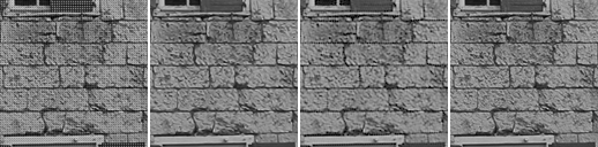

### kodim02

Mosaic · AHD (libraw) (40.08 dB) · Mimizan (37.64 dB) · ground truth — window at (224, 90)

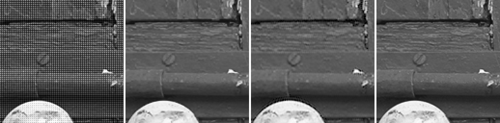

### kodim03

Mosaic · AMaZE (RawTherapee) (45.13 dB) · Mimizan (40.24 dB) · ground truth — window at (163, 76)

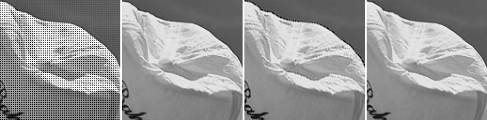

### kodim04

Mosaic · AMaZE (RawTherapee) (41.37 dB) · Mimizan (38.85 dB) · ground truth — window at (240, 33)

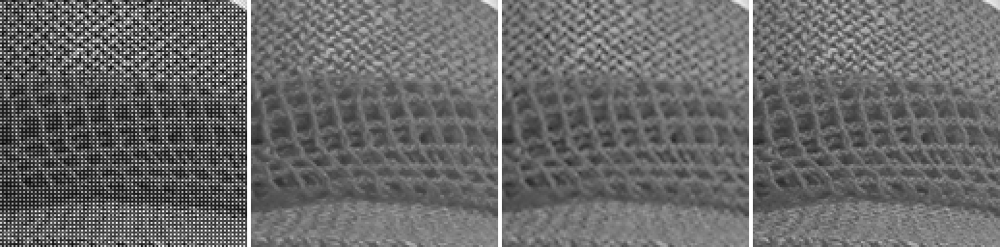

### kodim05

Mosaic · AMaZE (RawTherapee) (38.00 dB) · Mimizan (32.70 dB) · ground truth — window at (445, 326)

### kodim06

Mosaic · AMaZE (RawTherapee) (40.46 dB) · Mimizan (35.29 dB) · ground truth — window at (246, 62)

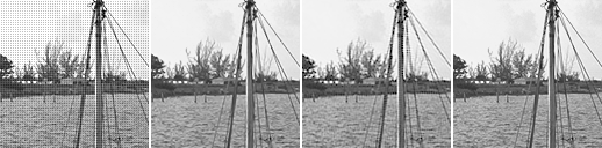

### kodim07

Mosaic · AMaZE (RawTherapee) (44.59 dB) · Mimizan (38.93 dB) · ground truth — window at (340, 154)

### kodim08

Mosaic · AMaZE (RawTherapee) (37.32 dB) · Mimizan (31.63 dB) · ground truth — window at (103, 339)

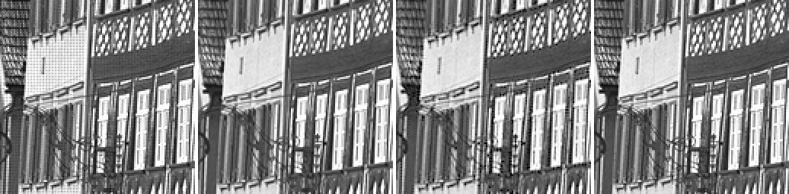

### kodim09

Mosaic · AMaZE (RawTherapee) (44.42 dB) · Mimizan (39.91 dB) · ground truth — window at (114, 543)

### kodim10

Mosaic · AMaZE (RawTherapee) (44.57 dB) · Mimizan (40.67 dB) · ground truth — window at (345, 512)

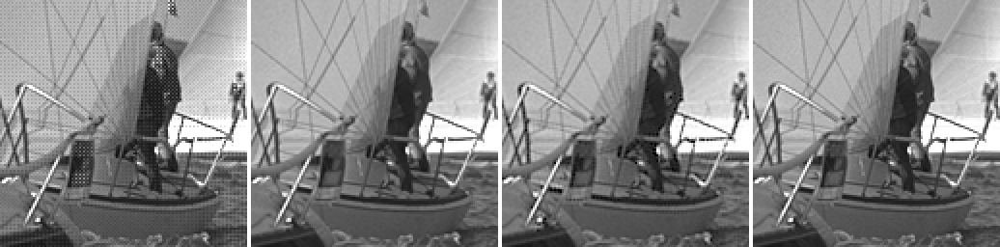

### kodim11

Mosaic · AMaZE (RawTherapee) (39.46 dB) · Mimizan (34.68 dB) · ground truth — window at (370, 215)

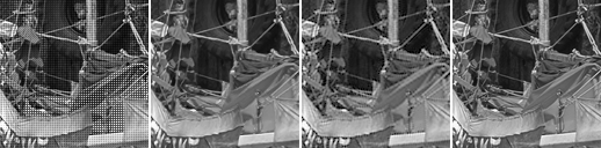

### kodim12

Mosaic · AMaZE (RawTherapee) (45.70 dB) · Mimizan (41.05 dB) · ground truth — window at (277, 136)

### kodim13

Mosaic · AMaZE (RawTherapee) (33.86 dB) · Mimizan (29.28 dB) · ground truth — window at (489, 225)

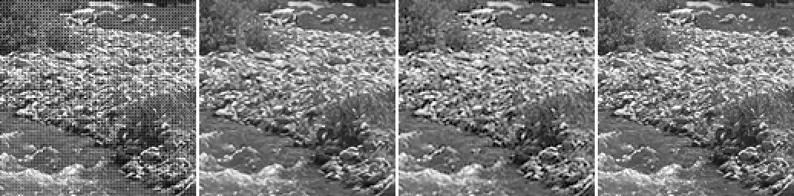

### kodim14

Mosaic · AMaZE (RawTherapee) (38.79 dB) · Mimizan (34.13 dB) · ground truth — window at (364, 245)

### kodim15

Mosaic · AMaZE (RawTherapee) (41.42 dB) · Mimizan (38.33 dB) · ground truth — window at (230, 184)

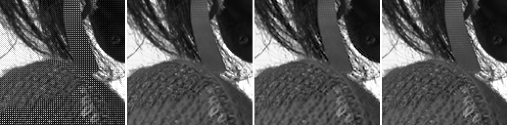

### kodim16

Mosaic · AMaZE (RawTherapee) (44.54 dB) · Mimizan (40.13 dB) · ground truth — window at (366, 202)

### kodim17

Mosaic · AMaZE (RawTherapee) (42.01 dB) · Mimizan (37.28 dB) · ground truth — window at (246, 88)

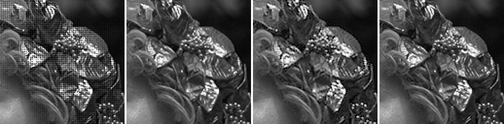

### kodim18

Mosaic · AMaZE (RawTherapee) (37.29 dB) · Mimizan (33.57 dB) · ground truth — window at (195, 267)

### kodim19

Mosaic · AMaZE (RawTherapee) (41.67 dB) · Mimizan (35.11 dB) · ground truth — window at (22, 445)

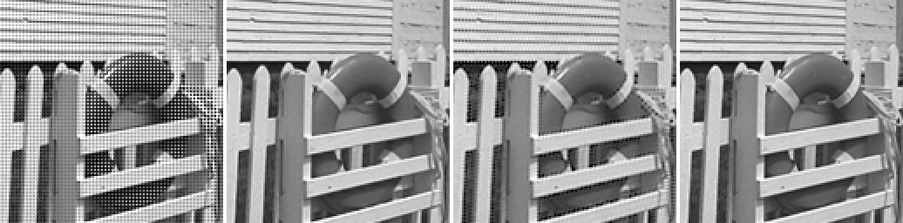

### kodim20

Mosaic · AMaZE (RawTherapee) (42.76 dB) · Mimizan (37.44 dB) · ground truth — window at (252, 226)

### kodim21

Mosaic · AMaZE (RawTherapee) (38.82 dB) · Mimizan (34.59 dB) · ground truth — window at (262, 286)

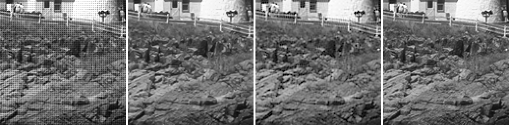

### kodim22

Mosaic · AMaZE (RawTherapee) (40.22 dB) · Mimizan (36.50 dB) · ground truth — window at (201, 167)

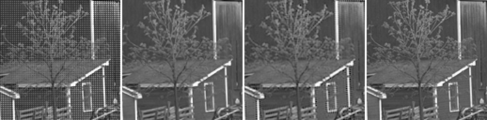

### kodim23

Mosaic · AMaZE (RawTherapee) (44.33 dB) · Mimizan (42.05 dB) · ground truth — window at (122, 182)

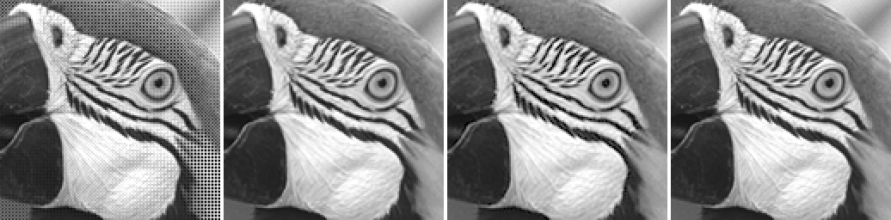

### kodim24

Mosaic · AMaZE (RawTherapee) (36.59 dB) · Mimizan (33.42 dB) · ground truth — window at (64, 16)

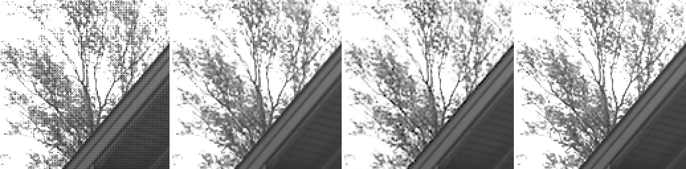

Kodak pictures: released by Eastman Kodak for unrestricted use; copies at <https://r0k.us/graphics/kodak/> and <https://github.com/lemire/kodakimagecollection>.
