# Kodak fake-Bayer benchmark

Generated by `mimizan bench kodak`. The 24 Kodak PhotoCD pictures (768×512, 8-bit sRGB, film scans without CFA artefacts) are linearised, sampled through an RGGB Bayer pattern and quantised to 16 bit. **Condition: 2× magnified (Lanczos-3) before mosaicking**, so the content is band-limited to 1/2 of Nyquist, the situation a lens and sensor produce (a real sensor never sees pixel-sharp colour edges). The identical mosaic goes to Mimizan and, as a DNG, to the external demosaicers. Their RGB output is reduced with the same weights as the ground truth, `(R + 2G + B)/4` (Mimizan's `Native` mix), so every number measures reconstruction of the luminance only: no tone curve, no sharpening, no noise reduction anywhere.

Metrics on sRGB-encoded 8-bit-scale values, 16 px border excluded: PSNR in dB and SSIM (Gaussian 11×11, σ = 1.5). Higher is better. The mosaic reaches Mimizan with a noise model of the 8-bit quantisation only (`σ ≈ 2.2·10⁻³·√s + 10⁻⁴`), so the block mask treats film grain as signal.

Converters:

- `dcraw_emu`: dcraw_emu: almost complete dcraw emulator
- `rawtherapee-cli`: RawTherapee, version 5.11, command line.

libraw: `dcraw_emu -4 -o 0 -r 1 1 1 1 -c 0 -H 0 -q N` (linear 16-bit, camera channels, unit balance). RawTherapee: `rawtherapee-cli -n -b16 -p <neutral profile with the demosaicer>`, sRGB transfer curve inverted on read. Both were verified to return the source channels unchanged on a smooth picture (see `docs/RESULTS.md`).

## PSNR (dB, luminance)

| Picture | Bilinear | AHD (libraw) | DHT (libraw) | AMaZE (RawTherapee) | RCD (RawTherapee) | Mimizan fixed | Mimizan block mask | Mimizan | Mimizan + reconstruct | computed |
|---|---|---|---|---|---|---|---|---|---|---|
| kodim01 | 36.44 | 46.57 | 43.78 | 47.01 | 48.65 | 43.83 | 39.18 | **49.86** | **51.72** | 6.2 % |
| kodim02 | 44.04 | 48.07 | 44.72 | 42.12 | 44.85 | 41.24 | 41.20 | **52.42** | **52.67** | 0.9 % |
| kodim03 | 45.74 | 51.84 | 45.45 | 52.95 | 54.37 | 46.81 | 46.35 | **55.00** | **56.04** | 2.4 % |
| kodim04 | 44.63 | 49.48 | 45.40 | 50.98 | 51.28 | 43.08 | 42.89 | **54.65** | **55.01** | 1.5 % |
| kodim05 | 34.61 | 43.17 | 40.02 | 43.14 | 43.56 | 40.27 | 38.84 | **45.90** | **47.74** | 12.3 % |
| kodim06 | 38.73 | 47.58 | 45.54 | 47.75 | 49.40 | 44.02 | 42.33 | **50.45** | **51.11** | 5.0 % |
| kodim07 | 43.33 | 50.16 | 47.01 | 50.84 | 52.37 | 46.17 | 46.06 | **53.59** | **54.52** | 2.9 % |
| kodim08 | 32.24 | 44.00 | 40.23 | 44.76 | 44.52 | 41.63 | 39.08 | **46.72** | **48.63** | 18.7 % |
| kodim09 | 41.81 | 51.43 | 49.75 | 51.82 | 52.72 | 47.55 | 45.95 | **53.64** | **55.87** | 2.9 % |
| kodim10 | 42.60 | 51.25 | 48.27 | 51.14 | 52.39 | 50.00 | 48.01 | **55.80** | **55.39** | 2.4 % |
| kodim11 | 38.36 | 45.75 | 44.63 | 46.79 | 46.86 | 41.77 | 41.20 | **48.44** | **50.50** | 4.5 % |
| kodim12 | 44.19 | 52.54 | 50.37 | 52.22 | 53.37 | 49.93 | 48.40 | **55.60** | **56.03** | 3.1 % |
| kodim13 | 32.92 | 40.66 | 37.80 | 41.11 | 41.70 | 38.33 | 34.18 | **43.62** | **45.04** | 12.2 % |
| kodim14 | 38.42 | 44.41 | 42.11 | 45.54 | 46.42 | 39.85 | 39.69 | **47.97** | **49.41** | 4.7 % |
| kodim15 | 42.64 | 49.73 | 45.48 | 49.99 | 50.24 | 44.60 | 43.79 | **51.78** | **54.04** | 4.8 % |
| kodim16 | 42.70 | 52.58 | 50.59 | 53.41 | 54.84 | 49.48 | 46.34 | **56.09** | **57.08** | 1.3 % |
| kodim17 | 41.20 | 47.91 | 46.26 | 48.67 | 49.38 | 44.64 | 43.77 | **50.35** | **51.36** | 3.1 % |
| kodim18 | 37.11 | 43.62 | 41.68 | 44.40 | 45.07 | 40.41 | 39.80 | **46.63** | **47.60** | 5.1 % |
| kodim19 | 37.89 | 46.85 | 45.62 | 48.90 | 49.52 | 42.37 | 41.38 | 48.40 | **51.07** | 5.4 % |
| kodim20 | 39.93 | 48.51 | 45.99 | 48.93 | 49.60 | 45.21 | 43.01 | **51.37** | **52.89** | 4.5 % |
| kodim21 | 37.87 | 46.49 | 44.44 | 47.11 | 47.33 | 43.56 | 41.07 | **49.62** | **51.10** | 5.3 % |
| kodim22 | 40.63 | 46.57 | 45.50 | 47.78 | 48.32 | 43.10 | 42.37 | **49.28** | **49.71** | 2.8 % |
| kodim23 | 44.50 | 51.16 | 45.02 | 52.04 | 52.79 | 48.77 | 47.43 | **56.81** | **58.00** | 1.8 % |
| kodim24 | 36.09 | 42.31 | 39.81 | 42.38 | 43.47 | 39.75 | 38.54 | **45.22** | **44.50** | 7.6 % |
| **mean (24)** | **39.94** | **47.61** | **44.81** | **47.99** | **48.88** | 44.02 | 42.54 | **50.80** | **51.96** | 5.1 % |

Bold in the two Mimizan columns: at least as good as the best external demosaicer on that picture. "computed" is the share of the picture the reconstruction step took over (mean β).

## SSIM (luminance)

| Picture | Bilinear | AHD (libraw) | DHT (libraw) | AMaZE (RawTherapee) | RCD (RawTherapee) | Mimizan fixed | Mimizan block mask | Mimizan | Mimizan + reconstruct |
|---|---|---|---|---|---|---|---|---|---|
| kodim01 | 0.9829 | 0.9975 | 0.9963 | 0.9979 | 0.9986 | 0.9942 | 0.9898 | 0.9991 | 0.9992 |
| kodim02 | 0.9915 | 0.9958 | 0.9867 | 0.9871 | 0.9935 | 0.9741 | 0.9741 | 0.9984 | 0.9984 |
| kodim03 | 0.9952 | 0.9986 | 0.9920 | 0.9989 | 0.9992 | 0.9949 | 0.9943 | 0.9994 | 0.9994 |
| kodim04 | 0.9927 | 0.9968 | 0.9928 | 0.9978 | 0.9981 | 0.9859 | 0.9849 | 0.9991 | 0.9991 |
| kodim05 | 0.9825 | 0.9966 | 0.9932 | 0.9970 | 0.9976 | 0.9892 | 0.9864 | 0.9983 | 0.9987 |
| kodim06 | 0.9880 | 0.9983 | 0.9975 | 0.9981 | 0.9989 | 0.9956 | 0.9934 | 0.9992 | 0.9993 |
| kodim07 | 0.9955 | 0.9986 | 0.9969 | 0.9988 | 0.9992 | 0.9953 | 0.9951 | 0.9994 | 0.9994 |
| kodim08 | 0.9796 | 0.9977 | 0.9968 | 0.9983 | 0.9985 | 0.9950 | 0.9913 | 0.9989 | 0.9992 |
| kodim09 | 0.9936 | 0.9986 | 0.9981 | 0.9988 | 0.9992 | 0.9975 | 0.9956 | 0.9995 | 0.9995 |
| kodim10 | 0.9940 | 0.9986 | 0.9982 | 0.9987 | 0.9992 | 0.9978 | 0.9959 | 0.9995 | 0.9995 |
| kodim11 | 0.9874 | 0.9976 | 0.9969 | 0.9981 | 0.9984 | 0.9911 | 0.9898 | 0.9986 | 0.9990 |
| kodim12 | 0.9939 | 0.9987 | 0.9981 | 0.9987 | 0.9992 | 0.9973 | 0.9957 | 0.9995 | 0.9995 |
| kodim13 | 0.9763 | 0.9955 | 0.9928 | 0.9965 | 0.9974 | 0.9908 | 0.9772 | 0.9980 | 0.9984 |
| kodim14 | 0.9878 | 0.9969 | 0.9931 | 0.9974 | 0.9982 | 0.9888 | 0.9877 | 0.9988 | 0.9990 |
| kodim15 | 0.9924 | 0.9974 | 0.9926 | 0.9979 | 0.9978 | 0.9894 | 0.9872 | 0.9989 | 0.9991 |
| kodim16 | 0.9910 | 0.9988 | 0.9984 | 0.9989 | 0.9993 | 0.9978 | 0.9957 | 0.9996 | 0.9996 |
| kodim17 | 0.9930 | 0.9982 | 0.9978 | 0.9986 | 0.9990 | 0.9963 | 0.9942 | 0.9993 | 0.9994 |
| kodim18 | 0.9870 | 0.9964 | 0.9946 | 0.9971 | 0.9980 | 0.9909 | 0.9897 | 0.9986 | 0.9988 |
| kodim19 | 0.9886 | 0.9976 | 0.9968 | 0.9985 | 0.9989 | 0.9937 | 0.9897 | 0.9989 | 0.9991 |
| kodim20 | 0.9926 | 0.9981 | 0.9960 | 0.9984 | 0.9986 | 0.9934 | 0.9904 | 0.9991 | 0.9993 |
| kodim21 | 0.9889 | 0.9977 | 0.9967 | 0.9981 | 0.9985 | 0.9950 | 0.9908 | 0.9991 | 0.9992 |
| kodim22 | 0.9904 | 0.9972 | 0.9960 | 0.9979 | 0.9985 | 0.9930 | 0.9913 | 0.9989 | 0.9989 |
| kodim23 | 0.9965 | 0.9984 | 0.9880 | 0.9987 | 0.9991 | 0.9951 | 0.9943 | 0.9994 | 0.9994 |
| kodim24 | 0.9885 | 0.9975 | 0.9962 | 0.9976 | 0.9984 | 0.9947 | 0.9915 | 0.9989 | 0.9988 |
| **mean (24)** | **0.9896** | **0.9976** | **0.9951** | **0.9977** | **0.9984** | 0.9928 | 0.9902 | **0.9990** | **0.9991** |

Mimizan is at or above the best external demosaicer on 23 of 24 pictures (PSNR); with the reconstruction step on 24 of 24. "Mimizan" is the default pipeline (`--mask dubois`: pixel-adaptive weighting of the two C2 copies and of two direction-dependent C1 bands, elongated pass bands). "Mimizan fixed" is the same separation with square 0.15 c/px bands and the two C2 copies averaged (`--mask off`); "Mimizan block mask" is the fixed separation with the 64 px block-spectrum mask (`--mask adaptive`). The differences between the three columns are what the adaptive steps contribute. "Mimizan + reconstruct" is the default pipeline with the optional nonlinear step (`--reconstruct`, off by default): where the linear luminance still carries energy near the carriers, a per-pixel direction decision on the colour differences replaces the filter output. Those pixels are computed, not measured; the "computed" column says how many.

## Crops

Each strip: **mosaic** as the sensor records it (grey, CFA pattern visible) · **best external demosaicer → mono** · **Mimizan** · **ground truth**. 128×128 px window at 2× (nearest neighbour), chosen automatically as the region with the largest combined error of the two estimates, i.e. the hardest spot for both, not a hand-picked win.

### kodim01

Mosaic · RCD (RawTherapee) (48.65 dB) · Mimizan (49.86 dB) · ground truth — window at (1272, 67)

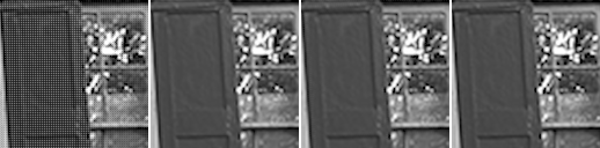

### kodim02

Mosaic · AHD (libraw) (48.07 dB) · Mimizan (52.42 dB) · ground truth — window at (453, 383)

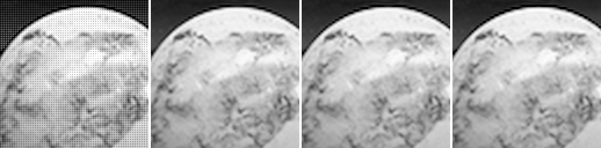

### kodim03

Mosaic · RCD (RawTherapee) (54.37 dB) · Mimizan (55.00 dB) · ground truth — window at (462, 200)

### kodim04

Mosaic · RCD (RawTherapee) (51.28 dB) · Mimizan (54.65 dB) · ground truth — window at (485, 1219)

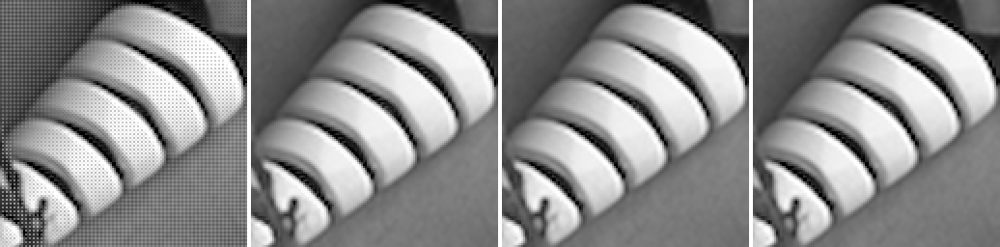

### kodim05

Mosaic · RCD (RawTherapee) (43.56 dB) · Mimizan (45.90 dB) · ground truth — window at (832, 40)

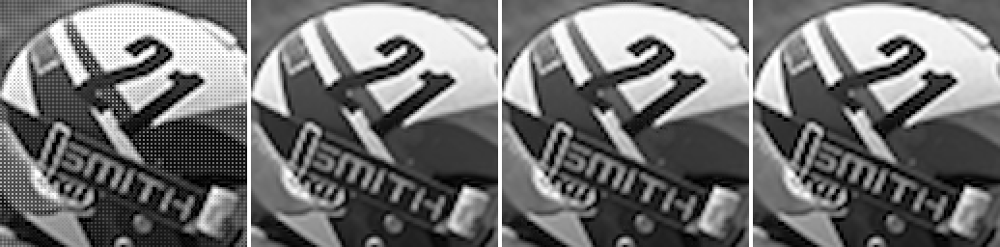

### kodim06

Mosaic · RCD (RawTherapee) (49.40 dB) · Mimizan (50.45 dB) · ground truth — window at (609, 119)

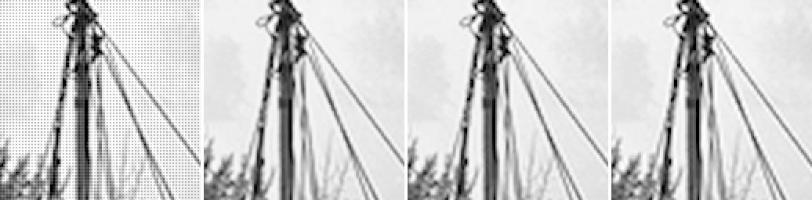

### kodim07

Mosaic · RCD (RawTherapee) (52.37 dB) · Mimizan (53.59 dB) · ground truth — window at (680, 329)

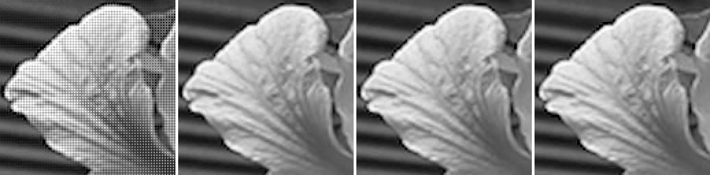

### kodim08

Mosaic · AMaZE (RawTherapee) (44.76 dB) · Mimizan (46.72 dB) · ground truth — window at (335, 610)

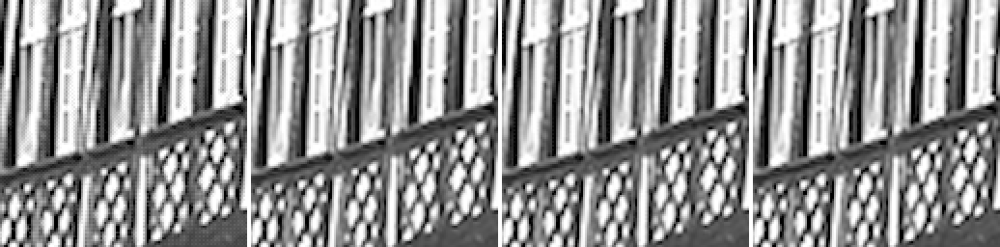

### kodim09

Mosaic · RCD (RawTherapee) (52.72 dB) · Mimizan (53.64 dB) · ground truth — window at (763, 802)

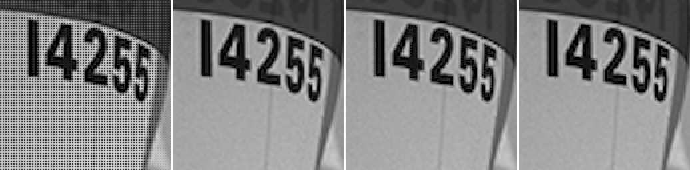

### kodim10

Mosaic · RCD (RawTherapee) (52.39 dB) · Mimizan (55.80 dB) · ground truth — window at (847, 1090)

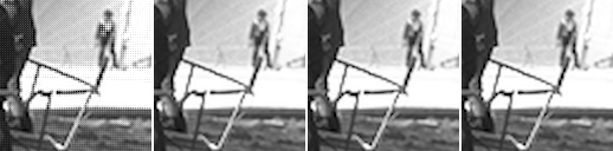

### kodim11

Mosaic · RCD (RawTherapee) (46.86 dB) · Mimizan (48.44 dB) · ground truth — window at (945, 442)

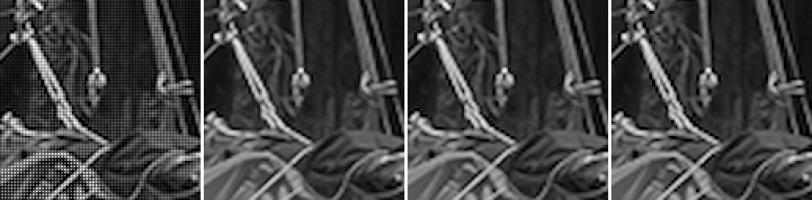

### kodim12

Mosaic · RCD (RawTherapee) (53.37 dB) · Mimizan (55.60 dB) · ground truth — window at (600, 361)

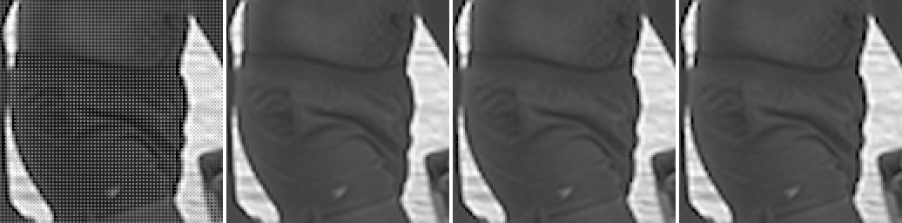

### kodim13

Mosaic · RCD (RawTherapee) (41.70 dB) · Mimizan (43.62 dB) · ground truth — window at (145, 603)

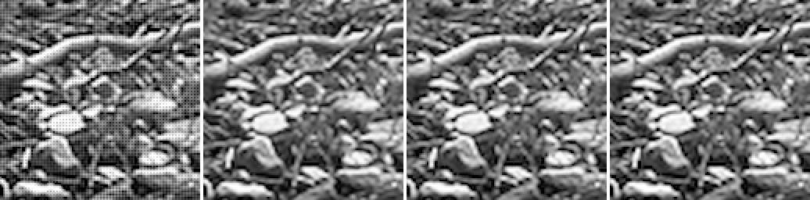

### kodim14

Mosaic · RCD (RawTherapee) (46.42 dB) · Mimizan (47.97 dB) · ground truth — window at (1047, 768)

### kodim15

Mosaic · RCD (RawTherapee) (50.24 dB) · Mimizan (51.78 dB) · ground truth — window at (1209, 682)

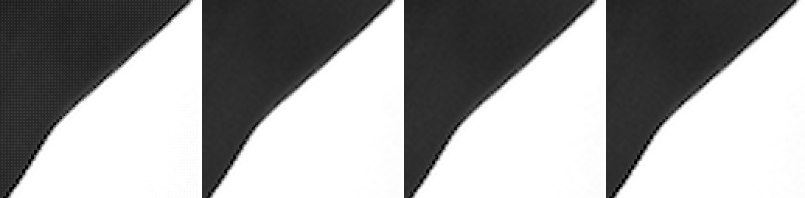

### kodim16

Mosaic · RCD (RawTherapee) (54.84 dB) · Mimizan (56.09 dB) · ground truth — window at (786, 402)

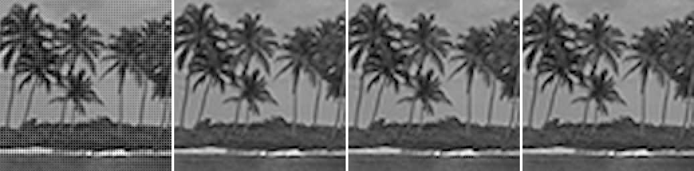

### kodim17

Mosaic · RCD (RawTherapee) (49.38 dB) · Mimizan (50.35 dB) · ground truth — window at (560, 246)

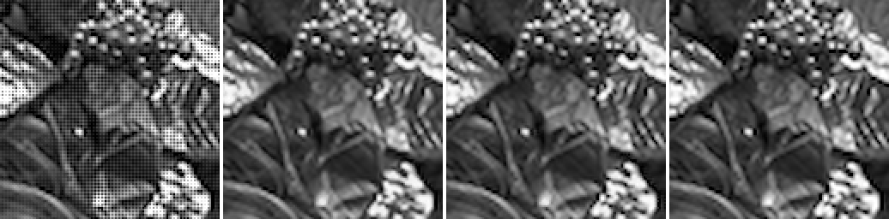

### kodim18

Mosaic · RCD (RawTherapee) (45.07 dB) · Mimizan (46.63 dB) · ground truth — window at (519, 593)

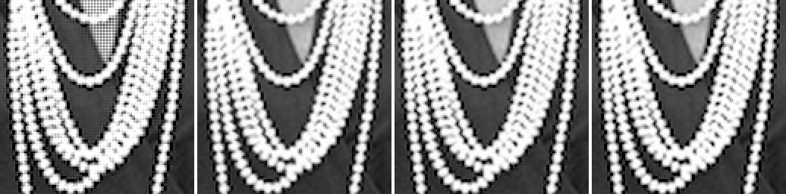

### kodim19

Mosaic · RCD (RawTherapee) (49.52 dB) · Mimizan (48.40 dB) · ground truth — window at (133, 1024)

### kodim20

Mosaic · RCD (RawTherapee) (49.60 dB) · Mimizan (51.37 dB) · ground truth — window at (510, 490)

### kodim21

Mosaic · RCD (RawTherapee) (47.33 dB) · Mimizan (49.62 dB) · ground truth — window at (652, 534)

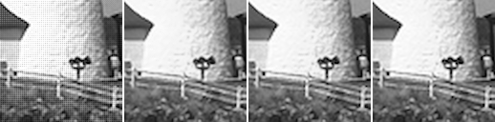

### kodim22

Mosaic · RCD (RawTherapee) (48.32 dB) · Mimizan (49.28 dB) · ground truth — window at (546, 326)

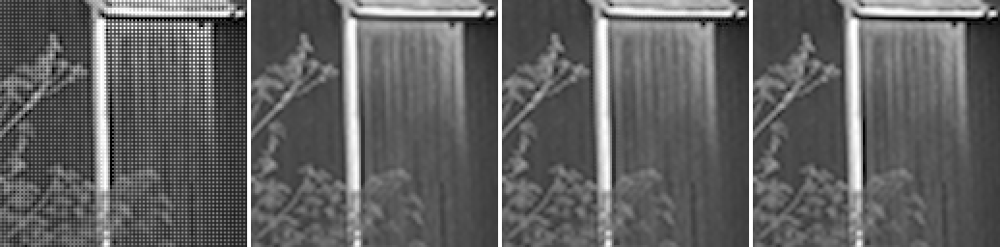

### kodim23

Mosaic · RCD (RawTherapee) (52.79 dB) · Mimizan (56.81 dB) · ground truth — window at (333, 409)

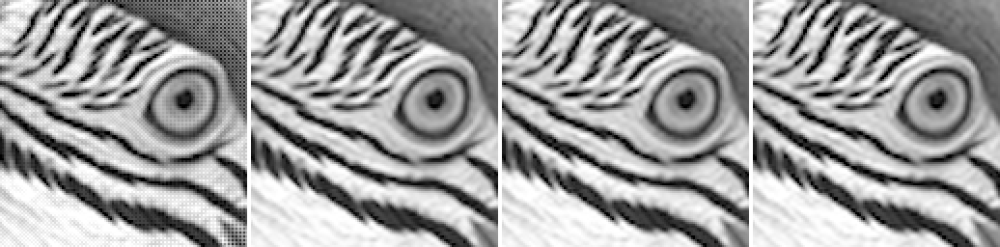

### kodim24

Mosaic · RCD (RawTherapee) (43.47 dB) · Mimizan (45.22 dB) · ground truth — window at (1021, 259)

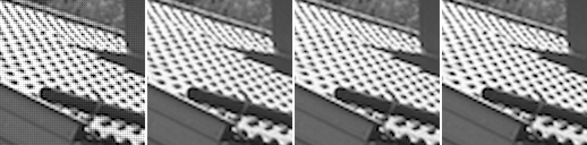

Kodak pictures: released by Eastman Kodak for unrestricted use; copies at <https://r0k.us/graphics/kodak/> and <https://github.com/lemire/kodakimagecollection>.
