# Kodak fake-Bayer benchmark

Generated by `mimizan bench kodak`. The 24 Kodak PhotoCD pictures (768×512, 8-bit sRGB, film scans without CFA artefacts) are linearised, sampled through an RGGB Bayer pattern and quantised to 16 bit. **Condition: 2× magnified (Lanczos-3) before mosaicking**, so the content is band-limited to 1/2 of Nyquist, the situation a lens and sensor produce (a real sensor never sees pixel-sharp colour edges). The identical mosaic goes to Mimizan and, as a DNG, to the external demosaicers. Their RGB output is reduced with the same weights as the ground truth, `(R + 2G + B)/4` (Mimizan's `Native` mix), so every number measures reconstruction of the luminance only: no tone curve, no sharpening, no noise reduction anywhere.

Metrics on sRGB-encoded 8-bit-scale values, 16 px border excluded: PSNR in dB and SSIM (Gaussian 11×11, σ = 1.5). Higher is better. The mosaic reaches Mimizan with a noise model of the 8-bit quantisation only (`σ ≈ 2.2·10⁻³·√s + 10⁻⁴`), so the block mask treats film grain as signal.

Converters:

- `dcraw_emu`: dcraw_emu: almost complete dcraw emulator
- `rawtherapee-cli`: RawTherapee, version 5.11, command line.

libraw: `dcraw_emu -4 -o 0 -r 1 1 1 1 -c 0 -H 0 -q N` (linear 16-bit, camera channels, unit balance). RawTherapee: `rawtherapee-cli -n -b16 -p <neutral profile with the demosaicer>`, sRGB transfer curve inverted on read. Both were verified to return the source channels unchanged on a smooth picture (see `docs/RESULTS.md`).

## PSNR (dB, luminance)

| Picture | Bilinear | VNG (libraw) | PPG (libraw) | AHD (libraw) | DCB (libraw) | DHT (libraw) | AAHD (libraw) | fast (RawTherapee) | VNG4 (RawTherapee) | AHD (RawTherapee) | EAHD (RawTherapee) | HPHD (RawTherapee) | DCB (RawTherapee) | LMMSE (RawTherapee) | IGV (RawTherapee) | AMaZE (RawTherapee) | RCD (RawTherapee) | Mimizan fixed | Mimizan block mask | Mimizan | Mimizan + reconstruct | computed |
|---|---|---|---|---|---|---|---|---|---|---|---|---|---|---|---|---|---|---|---|---|---|---|
| kodim01 | 36.44 | 42.63 | 46.46 | 46.57 | 43.45 | 43.78 | 45.80 | 44.60 | 42.28 | 45.96 | 45.91 | 45.07 | 49.54 | 47.23 | 46.26 | 47.01 | 48.65 | 43.83 | 39.18 | **49.86** | **51.72** | 6.2 % |
| kodim02 | 44.04 | 45.17 | 48.22 | 48.07 | 48.18 | 44.72 | 46.80 | 40.90 | 38.98 | 40.64 | 40.60 | 39.33 | 42.96 | 39.34 | 36.56 | 42.12 | 44.85 | 41.24 | 41.20 | **52.42** | **52.67** | 0.9 % |
| kodim03 | 45.74 | 49.94 | 52.17 | 51.84 | 50.85 | 45.45 | 50.46 | 50.46 | 49.57 | 52.59 | 52.64 | 51.29 | 51.21 | 50.97 | 48.14 | 52.95 | 54.37 | 46.81 | 46.35 | **55.00** | **56.04** | 2.4 % |
| kodim04 | 44.63 | 46.56 | 49.25 | 49.48 | 48.87 | 45.40 | 47.72 | 48.14 | 47.48 | 49.55 | 49.63 | 48.43 | 52.21 | 48.78 | 44.99 | 50.98 | 51.28 | 43.08 | 42.89 | **54.65** | **55.01** | 1.5 % |
| kodim05 | 34.61 | 41.04 | 43.48 | 43.17 | 40.55 | 40.02 | 40.93 | 40.67 | 40.66 | 42.47 | 42.49 | 41.48 | 44.79 | 44.73 | 40.53 | 43.14 | 43.56 | 40.27 | 38.84 | **45.90** | **47.74** | 12.3 % |
| kodim06 | 38.73 | 44.65 | 47.70 | 47.58 | 45.38 | 45.54 | 47.38 | 45.84 | 44.30 | 47.27 | 47.30 | 45.95 | 49.82 | 46.85 | 45.82 | 47.75 | 49.40 | 44.02 | 42.33 | **50.45** | **51.11** | 5.0 % |
| kodim07 | 43.33 | 47.98 | 50.59 | 50.16 | 48.89 | 47.01 | 49.15 | 48.75 | 48.28 | 50.81 | 50.88 | 49.92 | 51.43 | 49.86 | 47.84 | 50.84 | 52.37 | 46.17 | 46.06 | **53.59** | **54.52** | 2.9 % |
| kodim08 | 32.24 | 38.29 | 44.06 | 44.00 | 41.22 | 40.23 | 41.53 | 41.89 | 37.64 | 43.82 | 43.81 | 43.14 | 45.91 | 47.01 | 43.27 | 44.76 | 44.52 | 41.63 | 39.08 | 46.72 | **48.63** | 18.7 % |
| kodim09 | 41.81 | 47.76 | 51.60 | 51.43 | 49.33 | 49.75 | 50.96 | 49.32 | 47.07 | 51.07 | 51.12 | 50.26 | 52.87 | 53.04 | 49.15 | 51.82 | 52.72 | 47.55 | 45.95 | **53.64** | **55.87** | 2.9 % |
| kodim10 | 42.60 | 48.95 | 51.57 | 51.25 | 49.03 | 48.27 | 49.11 | 48.85 | 48.67 | 50.67 | 50.64 | 48.70 | 53.17 | 51.90 | 48.86 | 51.14 | 52.39 | 50.00 | 48.01 | **55.80** | **55.39** | 2.4 % |
| kodim11 | 38.36 | 43.56 | 46.03 | 45.75 | 44.25 | 44.63 | 44.87 | 43.97 | 42.88 | 45.45 | 45.52 | 44.66 | 47.65 | 49.04 | 42.88 | 46.79 | 46.86 | 41.77 | 41.20 | 48.44 | **50.50** | 4.5 % |
| kodim12 | 44.19 | 49.79 | 52.64 | 52.54 | 50.49 | 50.37 | 51.78 | 50.33 | 49.51 | 51.84 | 51.84 | 50.62 | 53.95 | 52.19 | 50.12 | 52.22 | 53.37 | 49.93 | 48.40 | **55.60** | **56.03** | 3.1 % |
| kodim13 | 32.92 | 38.85 | 40.83 | 40.66 | 38.04 | 37.80 | 38.77 | 38.69 | 38.94 | 40.32 | 40.35 | 39.75 | 42.31 | 41.30 | 39.33 | 41.11 | 41.70 | 38.33 | 34.18 | **43.62** | **45.04** | 12.2 % |
| kodim14 | 38.42 | 42.54 | 44.77 | 44.41 | 43.44 | 42.11 | 43.76 | 43.38 | 42.13 | 44.14 | 44.16 | 43.15 | 46.40 | 44.77 | 40.36 | 45.54 | 46.42 | 39.85 | 39.69 | **47.97** | **49.41** | 4.7 % |
| kodim15 | 42.64 | 47.14 | 49.61 | 49.73 | 47.43 | 45.48 | 47.97 | 47.35 | 46.26 | 49.07 | 49.07 | 47.39 | 51.50 | 50.52 | 44.20 | 49.99 | 50.24 | 44.60 | 43.79 | **51.78** | **54.04** | 4.8 % |
| kodim16 | 42.70 | 48.98 | 52.58 | 52.58 | 50.14 | 50.59 | 52.55 | 50.49 | 48.24 | 52.61 | 52.64 | 51.33 | 55.48 | 54.05 | 51.06 | 53.41 | 54.84 | 49.48 | 46.34 | **56.09** | **57.08** | 1.3 % |
| kodim17 | 41.20 | 46.05 | 48.22 | 47.91 | 46.35 | 46.26 | 46.95 | 46.54 | 45.87 | 48.16 | 48.20 | 47.66 | 49.59 | 48.96 | 45.51 | 48.67 | 49.38 | 44.64 | 43.77 | **50.35** | **51.36** | 3.1 % |
| kodim18 | 37.11 | 42.01 | 43.98 | 43.62 | 41.91 | 41.68 | 42.40 | 42.44 | 41.10 | 43.19 | 43.15 | 41.72 | 45.17 | 42.44 | 39.80 | 44.40 | 45.07 | 40.41 | 39.80 | **46.63** | **47.60** | 5.1 % |
| kodim19 | 37.89 | 42.88 | 47.06 | 46.85 | 45.53 | 45.62 | 46.19 | 46.40 | 42.21 | 48.03 | 48.04 | 47.49 | 49.24 | 48.99 | 45.96 | 48.90 | 49.52 | 42.37 | 41.38 | 48.40 | **51.07** | 5.4 % |
| kodim20 | 39.93 | 46.02 | 48.77 | 48.51 | 46.40 | 45.99 | 46.84 | 46.32 | 45.78 | 47.99 | 48.01 | 47.24 | 50.51 | 48.62 | 46.03 | 48.93 | 49.60 | 45.21 | 43.01 | **51.37** | **52.89** | 4.5 % |
| kodim21 | 37.87 | 43.94 | 46.65 | 46.49 | 44.15 | 44.44 | 45.15 | 44.22 | 42.37 | 45.50 | 45.66 | 44.55 | 48.47 | 49.55 | 41.80 | 47.11 | 47.33 | 43.56 | 41.07 | **49.62** | **51.10** | 5.3 % |
| kodim22 | 40.63 | 44.78 | 46.73 | 46.57 | 45.55 | 45.50 | 46.22 | 45.72 | 45.07 | 46.99 | 46.96 | 46.40 | 48.50 | 46.79 | 44.72 | 47.78 | 48.32 | 43.10 | 42.37 | **49.28** | **49.71** | 2.8 % |
| kodim23 | 44.50 | 49.52 | 51.41 | 51.16 | 50.26 | 45.03 | 48.67 | 48.81 | 48.51 | 49.66 | 49.68 | 48.90 | 53.10 | 51.39 | 46.18 | 52.04 | 52.79 | 48.77 | 47.43 | **56.81** | **58.00** | 1.8 % |
| kodim24 | 36.09 | 41.20 | 42.62 | 42.31 | 41.03 | 39.81 | 40.60 | 41.02 | 41.02 | 42.03 | 41.97 | 41.51 | 43.45 | 41.49 | 39.91 | 42.38 | 43.47 | 39.75 | 38.54 | **45.22** | **44.50** | 7.6 % |
| **mean (24)** | **39.94** | **45.01** | **47.79** | **47.61** | **45.86** | **44.81** | **46.36** | **45.63** | **44.37** | **47.08** | **47.09** | **46.08** | **49.13** | **47.91** | **44.55** | **47.99** | **48.88** | 44.02 | 42.54 | **50.80** | **51.96** | 5.1 % |

Bold in the two Mimizan columns: at least as good as the best external demosaicer on that picture. "computed" is the share of the picture the reconstruction step took over (mean β).

## SSIM (luminance)

| Picture | Bilinear | VNG (libraw) | PPG (libraw) | AHD (libraw) | DCB (libraw) | DHT (libraw) | AAHD (libraw) | fast (RawTherapee) | VNG4 (RawTherapee) | AHD (RawTherapee) | EAHD (RawTherapee) | HPHD (RawTherapee) | DCB (RawTherapee) | LMMSE (RawTherapee) | IGV (RawTherapee) | AMaZE (RawTherapee) | RCD (RawTherapee) | Mimizan fixed | Mimizan block mask | Mimizan | Mimizan + reconstruct |
|---|---|---|---|---|---|---|---|---|---|---|---|---|---|---|---|---|---|---|---|---|---|
| kodim01 | 0.9829 | 0.9955 | 0.9974 | 0.9975 | 0.9952 | 0.9963 | 0.9976 | 0.9958 | 0.9951 | 0.9972 | 0.9972 | 0.9965 | 0.9989 | 0.9980 | 0.9965 | 0.9979 | 0.9986 | 0.9942 | 0.9898 | 0.9991 | 0.9992 |
| kodim02 | 0.9915 | 0.9904 | 0.9956 | 0.9958 | 0.9962 | 0.9867 | 0.9923 | 0.9864 | 0.9792 | 0.9859 | 0.9856 | 0.9799 | 0.9897 | 0.9717 | 0.9637 | 0.9871 | 0.9935 | 0.9741 | 0.9741 | 0.9984 | 0.9984 |
| kodim03 | 0.9952 | 0.9976 | 0.9986 | 0.9986 | 0.9983 | 0.9920 | 0.9982 | 0.9982 | 0.9975 | 0.9987 | 0.9987 | 0.9981 | 0.9984 | 0.9978 | 0.9959 | 0.9989 | 0.9992 | 0.9949 | 0.9943 | 0.9994 | 0.9994 |
| kodim04 | 0.9927 | 0.9934 | 0.9966 | 0.9968 | 0.9967 | 0.9928 | 0.9950 | 0.9962 | 0.9956 | 0.9972 | 0.9972 | 0.9962 | 0.9982 | 0.9963 | 0.9913 | 0.9978 | 0.9981 | 0.9859 | 0.9849 | 0.9991 | 0.9991 |
| kodim05 | 0.9825 | 0.9947 | 0.9967 | 0.9966 | 0.9950 | 0.9932 | 0.9951 | 0.9947 | 0.9944 | 0.9964 | 0.9964 | 0.9951 | 0.9978 | 0.9971 | 0.9927 | 0.9970 | 0.9976 | 0.9892 | 0.9864 | 0.9983 | 0.9987 |
| kodim06 | 0.9880 | 0.9969 | 0.9981 | 0.9983 | 0.9969 | 0.9975 | 0.9985 | 0.9971 | 0.9962 | 0.9981 | 0.9980 | 0.9971 | 0.9990 | 0.9977 | 0.9962 | 0.9981 | 0.9989 | 0.9956 | 0.9934 | 0.9992 | 0.9993 |
| kodim07 | 0.9955 | 0.9976 | 0.9986 | 0.9986 | 0.9983 | 0.9969 | 0.9982 | 0.9982 | 0.9976 | 0.9987 | 0.9987 | 0.9983 | 0.9988 | 0.9980 | 0.9963 | 0.9988 | 0.9992 | 0.9953 | 0.9951 | 0.9994 | 0.9994 |
| kodim08 | 0.9796 | 0.9945 | 0.9977 | 0.9977 | 0.9961 | 0.9968 | 0.9971 | 0.9962 | 0.9934 | 0.9976 | 0.9976 | 0.9971 | 0.9988 | 0.9985 | 0.9964 | 0.9983 | 0.9985 | 0.9950 | 0.9913 | 0.9989 | 0.9992 |
| kodim09 | 0.9936 | 0.9977 | 0.9986 | 0.9986 | 0.9980 | 0.9981 | 0.9986 | 0.9978 | 0.9974 | 0.9986 | 0.9985 | 0.9981 | 0.9992 | 0.9985 | 0.9969 | 0.9988 | 0.9992 | 0.9975 | 0.9956 | 0.9995 | 0.9995 |
| kodim10 | 0.9940 | 0.9979 | 0.9987 | 0.9986 | 0.9980 | 0.9982 | 0.9986 | 0.9979 | 0.9977 | 0.9986 | 0.9986 | 0.9981 | 0.9992 | 0.9984 | 0.9968 | 0.9987 | 0.9992 | 0.9978 | 0.9959 | 0.9995 | 0.9995 |
| kodim11 | 0.9874 | 0.9959 | 0.9976 | 0.9976 | 0.9966 | 0.9969 | 0.9974 | 0.9964 | 0.9948 | 0.9976 | 0.9976 | 0.9965 | 0.9986 | 0.9984 | 0.9941 | 0.9981 | 0.9984 | 0.9911 | 0.9898 | 0.9986 | 0.9990 |
| kodim12 | 0.9939 | 0.9979 | 0.9987 | 0.9987 | 0.9981 | 0.9981 | 0.9987 | 0.9981 | 0.9976 | 0.9987 | 0.9987 | 0.9980 | 0.9992 | 0.9982 | 0.9971 | 0.9987 | 0.9992 | 0.9973 | 0.9957 | 0.9995 | 0.9995 |
| kodim13 | 0.9763 | 0.9940 | 0.9955 | 0.9955 | 0.9917 | 0.9928 | 0.9952 | 0.9928 | 0.9943 | 0.9958 | 0.9958 | 0.9952 | 0.9974 | 0.9963 | 0.9944 | 0.9965 | 0.9974 | 0.9908 | 0.9772 | 0.9980 | 0.9984 |
| kodim14 | 0.9878 | 0.9951 | 0.9969 | 0.9969 | 0.9958 | 0.9931 | 0.9965 | 0.9957 | 0.9939 | 0.9962 | 0.9962 | 0.9944 | 0.9980 | 0.9959 | 0.9890 | 0.9974 | 0.9982 | 0.9888 | 0.9877 | 0.9988 | 0.9990 |
| kodim15 | 0.9924 | 0.9951 | 0.9972 | 0.9974 | 0.9968 | 0.9926 | 0.9962 | 0.9963 | 0.9948 | 0.9974 | 0.9974 | 0.9953 | 0.9982 | 0.9973 | 0.9885 | 0.9979 | 0.9978 | 0.9894 | 0.9872 | 0.9989 | 0.9991 |
| kodim16 | 0.9910 | 0.9977 | 0.9987 | 0.9988 | 0.9980 | 0.9984 | 0.9989 | 0.9980 | 0.9973 | 0.9988 | 0.9987 | 0.9983 | 0.9994 | 0.9988 | 0.9978 | 0.9989 | 0.9993 | 0.9978 | 0.9957 | 0.9996 | 0.9996 |
| kodim17 | 0.9930 | 0.9976 | 0.9983 | 0.9982 | 0.9975 | 0.9978 | 0.9979 | 0.9975 | 0.9975 | 0.9983 | 0.9983 | 0.9978 | 0.9991 | 0.9984 | 0.9964 | 0.9986 | 0.9990 | 0.9963 | 0.9942 | 0.9993 | 0.9994 |
| kodim18 | 0.9870 | 0.9949 | 0.9965 | 0.9964 | 0.9951 | 0.9946 | 0.9959 | 0.9953 | 0.9937 | 0.9962 | 0.9962 | 0.9937 | 0.9976 | 0.9949 | 0.9884 | 0.9971 | 0.9980 | 0.9909 | 0.9897 | 0.9986 | 0.9988 |
| kodim19 | 0.9886 | 0.9960 | 0.9976 | 0.9976 | 0.9966 | 0.9968 | 0.9975 | 0.9967 | 0.9956 | 0.9980 | 0.9979 | 0.9976 | 0.9987 | 0.9981 | 0.9954 | 0.9985 | 0.9989 | 0.9937 | 0.9897 | 0.9989 | 0.9991 |
| kodim20 | 0.9926 | 0.9971 | 0.9981 | 0.9981 | 0.9974 | 0.9960 | 0.9972 | 0.9973 | 0.9965 | 0.9982 | 0.9982 | 0.9968 | 0.9986 | 0.9958 | 0.9926 | 0.9984 | 0.9986 | 0.9934 | 0.9904 | 0.9991 | 0.9993 |
| kodim21 | 0.9889 | 0.9965 | 0.9977 | 0.9977 | 0.9965 | 0.9967 | 0.9972 | 0.9964 | 0.9953 | 0.9974 | 0.9974 | 0.9964 | 0.9987 | 0.9978 | 0.9930 | 0.9981 | 0.9985 | 0.9950 | 0.9908 | 0.9991 | 0.9992 |
| kodim22 | 0.9904 | 0.9959 | 0.9972 | 0.9972 | 0.9963 | 0.9960 | 0.9969 | 0.9962 | 0.9958 | 0.9974 | 0.9974 | 0.9968 | 0.9983 | 0.9966 | 0.9933 | 0.9979 | 0.9985 | 0.9930 | 0.9913 | 0.9989 | 0.9989 |
| kodim23 | 0.9965 | 0.9973 | 0.9984 | 0.9984 | 0.9983 | 0.9880 | 0.9977 | 0.9979 | 0.9970 | 0.9983 | 0.9983 | 0.9974 | 0.9982 | 0.9978 | 0.9935 | 0.9987 | 0.9991 | 0.9951 | 0.9943 | 0.9994 | 0.9994 |
| kodim24 | 0.9885 | 0.9965 | 0.9976 | 0.9975 | 0.9962 | 0.9962 | 0.9971 | 0.9963 | 0.9961 | 0.9974 | 0.9974 | 0.9967 | 0.9984 | 0.9970 | 0.9949 | 0.9976 | 0.9984 | 0.9947 | 0.9915 | 0.9989 | 0.9988 |
| **mean (24)** | **0.9896** | **0.9960** | **0.9976** | **0.9976** | **0.9967** | **0.9951** | **0.9971** | **0.9962** | **0.9952** | **0.9972** | **0.9972** | **0.9961** | **0.9982** | **0.9964** | **0.9930** | **0.9977** | **0.9984** | 0.9928 | 0.9902 | **0.9990** | **0.9991** |

Mimizan is at or above the best external demosaicer on 21 of 24 pictures (PSNR); with the reconstruction step on 24 of 24. "Mimizan" is the default pipeline (`--mask dubois`: pixel-adaptive weighting of the two C2 copies and of two direction-dependent C1 bands, elongated pass bands). "Mimizan fixed" is the same separation with square 0.15 c/px bands and the two C2 copies averaged (`--mask off`); "Mimizan block mask" is the fixed separation with the 64 px block-spectrum mask (`--mask adaptive`). The differences between the three columns are what the adaptive steps contribute. "Mimizan + reconstruct" is the default pipeline with the optional nonlinear step (`--reconstruct`, off by default): where the linear luminance still carries energy near the carriers, a per-pixel direction decision on the colour differences replaces the filter output. Those pixels are computed, not measured; the "computed" column says how many.

## Crops

Each strip: **mosaic** as the sensor records it (grey, CFA pattern visible) · **best external demosaicer → mono** · **Mimizan** · **ground truth**. 128×128 px window at 2× (nearest neighbour), chosen automatically as the region with the largest combined error of the two estimates, i.e. the hardest spot for both, not a hand-picked win.

### kodim01

Mosaic · DCB (RawTherapee) (49.54 dB) · Mimizan (49.86 dB) · ground truth — window at (1272, 67)

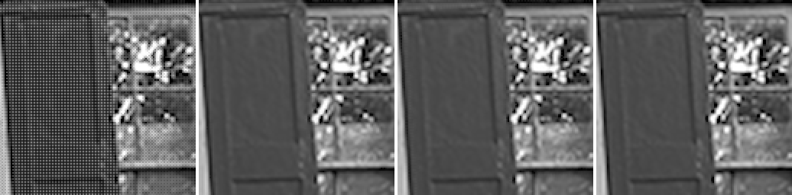

### kodim02

Mosaic · PPG (libraw) (48.22 dB) · Mimizan (52.42 dB) · ground truth — window at (453, 383)

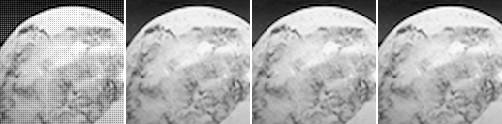

### kodim03

Mosaic · RCD (RawTherapee) (54.37 dB) · Mimizan (55.00 dB) · ground truth — window at (462, 200)

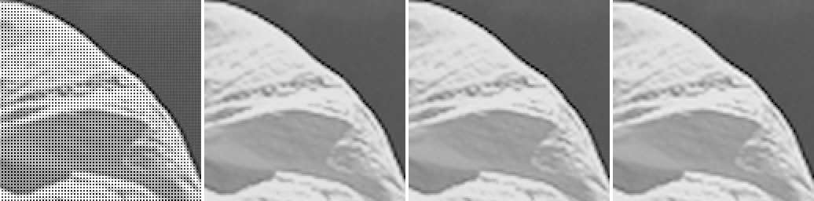

### kodim04

Mosaic · DCB (RawTherapee) (52.21 dB) · Mimizan (54.65 dB) · ground truth — window at (485, 1219)

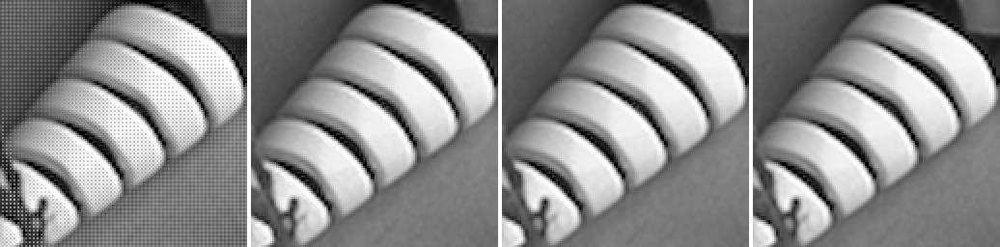

### kodim05

Mosaic · DCB (RawTherapee) (44.79 dB) · Mimizan (45.90 dB) · ground truth — window at (832, 40)

### kodim06

Mosaic · DCB (RawTherapee) (49.82 dB) · Mimizan (50.45 dB) · ground truth — window at (609, 119)

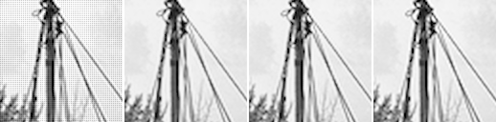

### kodim07

Mosaic · RCD (RawTherapee) (52.37 dB) · Mimizan (53.59 dB) · ground truth — window at (680, 329)

### kodim08

Mosaic · LMMSE (RawTherapee) (47.01 dB) · Mimizan (46.72 dB) · ground truth — window at (335, 614)

### kodim09

Mosaic · LMMSE (RawTherapee) (53.04 dB) · Mimizan (53.64 dB) · ground truth — window at (763, 788)

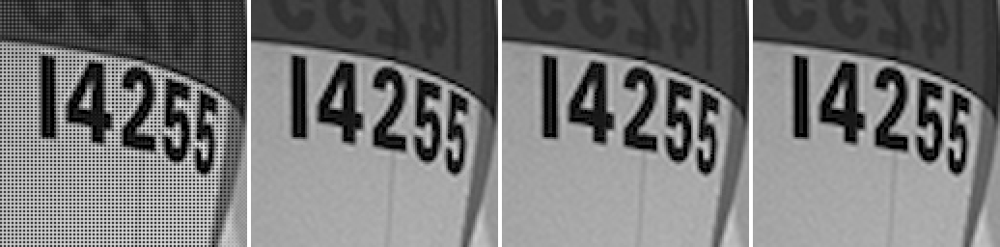

### kodim10

Mosaic · DCB (RawTherapee) (53.17 dB) · Mimizan (55.80 dB) · ground truth — window at (847, 1088)

### kodim11

Mosaic · LMMSE (RawTherapee) (49.04 dB) · Mimizan (48.44 dB) · ground truth — window at (946, 444)

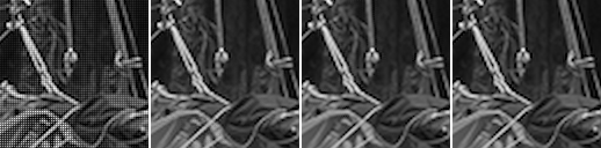

### kodim12

Mosaic · DCB (RawTherapee) (53.95 dB) · Mimizan (55.60 dB) · ground truth — window at (599, 361)

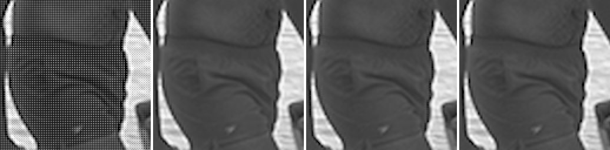

### kodim13

Mosaic · DCB (RawTherapee) (42.31 dB) · Mimizan (43.62 dB) · ground truth — window at (145, 597)

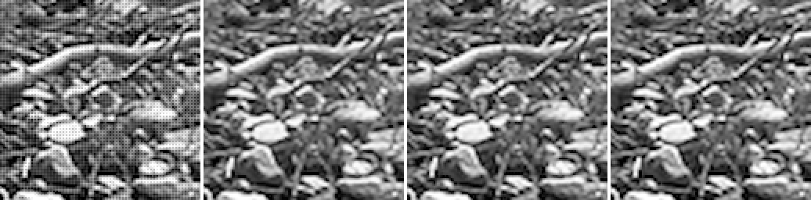

### kodim14

Mosaic · RCD (RawTherapee) (46.42 dB) · Mimizan (47.97 dB) · ground truth — window at (1047, 768)

### kodim15

Mosaic · DCB (RawTherapee) (51.50 dB) · Mimizan (51.78 dB) · ground truth — window at (1231, 649)

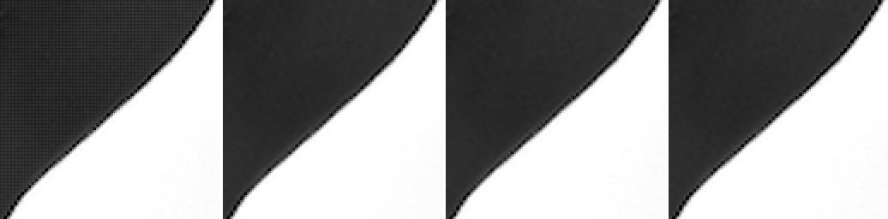

### kodim16

Mosaic · DCB (RawTherapee) (55.48 dB) · Mimizan (56.09 dB) · ground truth — window at (782, 403)

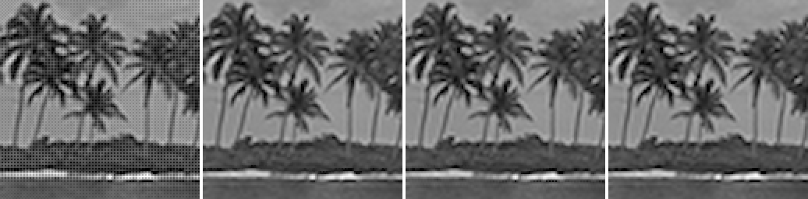

### kodim17

Mosaic · DCB (RawTherapee) (49.59 dB) · Mimizan (50.35 dB) · ground truth — window at (605, 246)

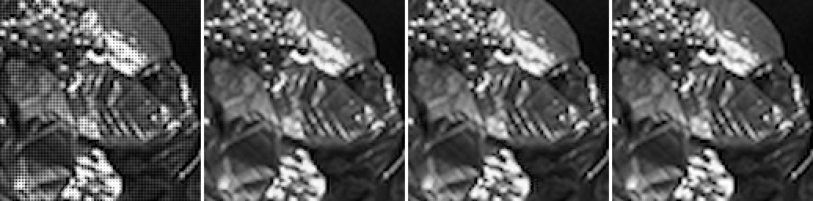

### kodim18

Mosaic · DCB (RawTherapee) (45.17 dB) · Mimizan (46.63 dB) · ground truth — window at (519, 593)

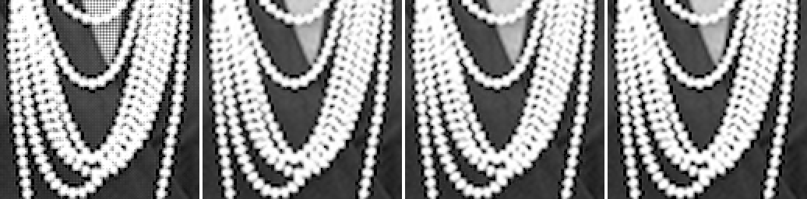

### kodim19

Mosaic · RCD (RawTherapee) (49.52 dB) · Mimizan (48.40 dB) · ground truth — window at (133, 1024)

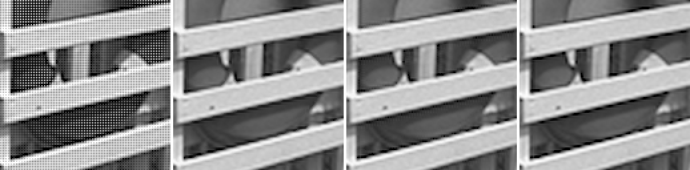

### kodim20

Mosaic · DCB (RawTherapee) (50.51 dB) · Mimizan (51.37 dB) · ground truth — window at (510, 492)

### kodim21

Mosaic · LMMSE (RawTherapee) (49.55 dB) · Mimizan (49.62 dB) · ground truth — window at (617, 488)

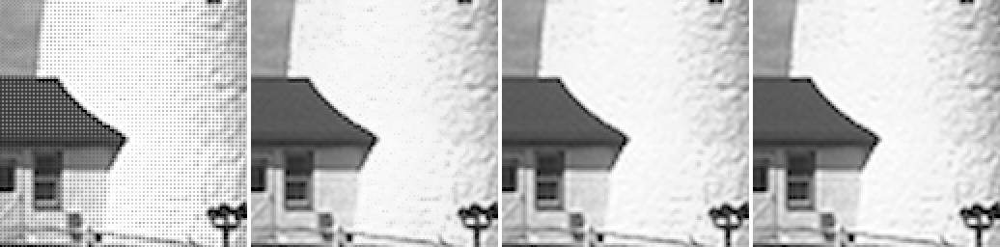

### kodim22

Mosaic · DCB (RawTherapee) (48.50 dB) · Mimizan (49.28 dB) · ground truth — window at (545, 326)

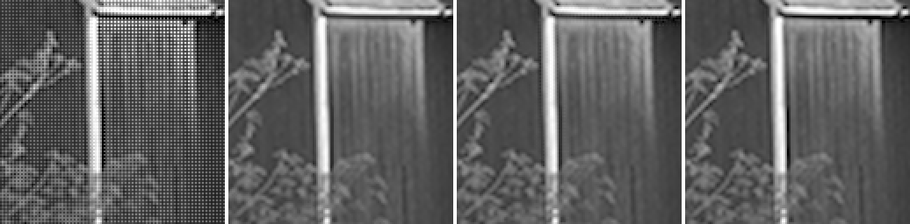

### kodim23

Mosaic · DCB (RawTherapee) (53.10 dB) · Mimizan (56.81 dB) · ground truth — window at (333, 409)

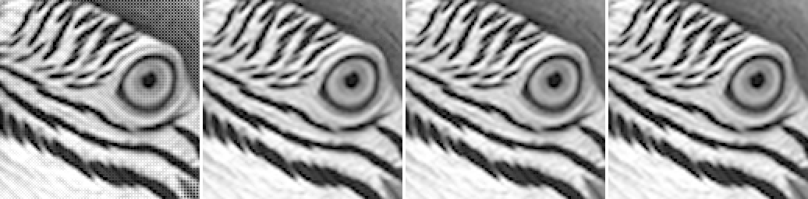

### kodim24

Mosaic · RCD (RawTherapee) (43.47 dB) · Mimizan (45.22 dB) · ground truth — window at (1021, 259)

Kodak pictures: released by Eastman Kodak for unrestricted use; copies at <https://r0k.us/graphics/kodak/> and <https://github.com/lemire/kodakimagecollection>.
