# Kodak fake-Bayer benchmark

Generated by `mimizan bench kodak`. The 24 Kodak PhotoCD pictures (768×512, 8-bit sRGB, film scans without CFA artefacts) are linearised, sampled through an RGGB Bayer pattern and quantised to 16 bit. **Condition: lens-like**, the pictures blurred with a Gaussian of σ = 0.75 px before mosaicking (MTF50 at 0.25 c/px, MTF at Nyquist 6 %), the shape of a lens and pixel-aperture MTF: content reaches Nyquist, attenuated, instead of stopping at half of it. The identical mosaic goes to Mimizan and, as a DNG, to the external demosaicers. Their RGB output is reduced with the same weights as the ground truth, `(R + 2G + B)/4` (Mimizan's `Native` mix), so every number measures reconstruction of the luminance only: no tone curve, no sharpening, no noise reduction anywhere.

Metrics on sRGB-encoded 8-bit-scale values, 16 px border excluded: PSNR in dB and SSIM (Gaussian 11×11, σ = 1.5). Higher is better. The mosaic reaches Mimizan with a noise model of the 8-bit quantisation only (`σ ≈ 2.2·10⁻³·√s + 10⁻⁴`), so the block mask treats film grain as signal.

Converters:

- `dcraw_emu`: dcraw_emu: almost complete dcraw emulator
- `rawtherapee-cli`: RawTherapee, version 5.11, command line.

libraw: `dcraw_emu -4 -o 0 -r 1 1 1 1 -c 0 -H 0 -q N` (linear 16-bit, camera channels, unit balance). RawTherapee: `rawtherapee-cli -n -b16 -p <neutral profile with the demosaicer>`, sRGB transfer curve inverted on read. Both were verified to return the source channels unchanged on a smooth picture (see `docs/RESULTS.md`).

## PSNR (dB, luminance)

| Picture | Bilinear | VNG (libraw) | PPG (libraw) | AHD (libraw) | DCB (libraw) | DHT (libraw) | AAHD (libraw) | fast (RawTherapee) | VNG4 (RawTherapee) | AHD (RawTherapee) | EAHD (RawTherapee) | HPHD (RawTherapee) | DCB (RawTherapee) | LMMSE (RawTherapee) | IGV (RawTherapee) | AMaZE (RawTherapee) | RCD (RawTherapee) | Mimizan fixed | Mimizan block mask | Mimizan | Mimizan + reconstruct | computed |
|---|---|---|---|---|---|---|---|---|---|---|---|---|---|---|---|---|---|---|---|---|---|---|
| kodim01 | 37.81 | 44.07 | 46.33 | 46.93 | 43.81 | 47.32 | 48.62 | 44.93 | 42.24 | 47.40 | 47.33 | 48.16 | 50.17 | 50.95 | 48.67 | 50.03 | 48.42 | 44.08 | 41.54 | 48.14 | 50.90 | 28.1 % |
| kodim02 | 44.73 | 45.13 | 48.60 | 48.68 | 48.49 | 45.95 | 47.33 | 42.27 | 40.87 | 41.88 | 41.82 | 41.07 | 44.20 | 42.10 | 38.89 | 43.11 | 45.78 | 39.55 | 39.48 | **49.35** | **49.89** | 3.0 % |
| kodim03 | 45.70 | 49.49 | 51.37 | 51.28 | 50.22 | 47.88 | 51.75 | 49.85 | 48.77 | 52.49 | 52.50 | 51.66 | 53.05 | 52.38 | 47.36 | 54.14 | 54.84 | 45.24 | 45.12 | 53.06 | 54.12 | 3.9 % |
| kodim04 | 44.17 | 45.43 | 47.88 | 48.19 | 47.55 | 46.06 | 47.06 | 46.20 | 45.33 | 47.46 | 47.48 | 46.40 | 49.83 | 47.52 | 42.83 | 49.57 | 49.39 | 41.06 | 40.99 | **50.75** | **50.93** | 2.1 % |
| kodim05 | 36.71 | 43.30 | 44.79 | 44.81 | 41.82 | 43.80 | 45.80 | 42.52 | 42.29 | 44.51 | 44.53 | 43.25 | 48.84 | 46.47 | 41.78 | 46.38 | 47.51 | 41.02 | 38.83 | 46.58 | 48.54 | 14.0 % |
| kodim06 | 39.75 | 45.69 | 47.34 | 48.16 | 45.59 | 48.94 | 49.62 | 46.33 | 44.40 | 49.29 | 49.32 | 49.09 | 52.08 | 51.17 | 49.02 | 50.94 | 50.48 | 44.24 | 42.98 | 48.96 | 51.48 | 22.4 % |
| kodim07 | 42.73 | 47.73 | 50.23 | 50.14 | 48.48 | 49.21 | 50.32 | 49.17 | 47.28 | 50.89 | 50.97 | 49.92 | 53.15 | 49.67 | 46.20 | 51.89 | 53.65 | 45.34 | 45.20 | 52.30 | 53.45 | 4.1 % |
| kodim08 | 34.88 | 41.04 | 44.95 | 45.92 | 42.57 | 45.87 | 46.44 | 43.69 | 38.97 | 46.05 | 46.04 | 46.23 | 48.21 | 49.23 | 45.72 | 48.54 | 47.01 | 41.18 | 41.05 | 46.08 | **49.28** | 38.6 % |
| kodim09 | 42.16 | 47.85 | 51.67 | 52.02 | 49.44 | 51.98 | 52.84 | 50.17 | 46.54 | 52.22 | 52.28 | 51.75 | 55.53 | 53.78 | 48.78 | 53.95 | 54.30 | 47.48 | 46.22 | 52.78 | 55.45 | 7.0 % |
| kodim10 | 43.29 | 49.65 | 51.90 | 52.13 | 49.35 | 51.41 | 53.09 | 49.65 | 48.61 | 52.26 | 52.24 | 51.39 | 55.35 | 53.24 | 48.70 | 53.80 | 54.21 | 49.28 | 47.90 | 54.64 | 55.31 | 4.5 % |
| kodim11 | 40.46 | 45.68 | 47.71 | 47.93 | 45.97 | 48.64 | 48.51 | 46.55 | 44.48 | 48.37 | 48.33 | 47.23 | 51.33 | 51.13 | 44.43 | 50.54 | 50.15 | 41.21 | 41.17 | 48.17 | 50.67 | 14.0 % |
| kodim12 | 44.55 | 50.77 | 52.60 | 53.36 | 50.46 | 52.76 | 54.51 | 50.86 | 49.49 | 53.46 | 53.50 | 52.95 | 56.39 | 53.65 | 50.96 | 54.83 | 55.05 | 49.97 | 48.91 | 54.78 | 56.36 | 9.0 % |
| kodim13 | 36.26 | 42.40 | 42.11 | 42.85 | 40.05 | 43.62 | 44.40 | 40.90 | 41.95 | 43.31 | 43.34 | 43.62 | 46.38 | 46.04 | 43.22 | 45.77 | 44.82 | 41.20 | 37.10 | 45.11 | **47.71** | 29.5 % |
| kodim14 | 39.80 | 42.88 | 45.24 | 45.18 | 44.29 | 43.95 | 45.30 | 44.31 | 42.27 | 45.03 | 45.05 | 43.62 | 48.72 | 44.40 | 39.05 | 47.37 | 47.89 | 37.81 | 37.69 | 47.36 | 48.37 | 10.9 % |
| kodim15 | 43.64 | 47.15 | 49.09 | 49.35 | 47.63 | 46.42 | 49.10 | 47.13 | 46.40 | 49.00 | 49.04 | 47.11 | 51.43 | 49.54 | 42.73 | 50.46 | 49.53 | 41.83 | 41.65 | **51.76** | **53.03** | 7.3 % |
| kodim16 | 43.52 | 49.77 | 51.50 | 52.69 | 49.74 | 53.44 | 53.94 | 50.05 | 47.86 | 53.32 | 53.35 | 53.57 | 56.09 | 55.52 | 52.65 | 55.23 | 54.38 | 49.13 | 48.09 | 53.13 | 55.30 | 10.9 % |
| kodim17 | 43.09 | 48.89 | 49.85 | 49.92 | 47.84 | 50.17 | 50.76 | 48.26 | 48.52 | 50.31 | 50.32 | 50.13 | 54.14 | 52.99 | 47.97 | 52.52 | 52.79 | 46.28 | 45.71 | 51.66 | 53.84 | 4.8 % |
| kodim18 | 39.72 | 44.24 | 45.17 | 45.21 | 43.66 | 45.97 | 45.82 | 44.23 | 43.57 | 45.55 | 45.52 | 44.84 | 48.55 | 46.28 | 41.92 | 47.46 | 47.84 | 41.47 | 41.17 | 47.61 | **49.33** | 11.1 % |
| kodim19 | 39.05 | 44.12 | 48.28 | 48.57 | 46.86 | 49.50 | 48.95 | 48.29 | 42.25 | 50.66 | 50.65 | 50.47 | 53.40 | 52.74 | 48.69 | 52.60 | 51.97 | 41.97 | 41.85 | 48.16 | 51.36 | 15.4 % |
| kodim20 | 42.14 | 48.80 | 50.32 | 50.40 | 48.05 | 50.64 | 50.96 | 48.89 | 47.97 | 50.50 | 50.54 | 49.96 | 54.59 | 51.78 | 48.41 | 52.72 | 53.09 | 45.63 | 45.42 | 51.52 | 53.87 | 7.1 % |
| kodim21 | 39.81 | 45.92 | 47.07 | 47.49 | 44.98 | 48.46 | 48.53 | 45.75 | 43.91 | 47.11 | 47.07 | 46.06 | 51.24 | 51.74 | 43.90 | 49.84 | 49.29 | 44.57 | 43.26 | 49.26 | **51.76** | 13.8 % |
| kodim22 | 41.95 | 46.25 | 47.80 | 47.96 | 46.61 | 47.85 | 48.04 | 46.82 | 45.46 | 48.54 | 48.50 | 48.44 | 50.99 | 48.11 | 44.99 | 50.14 | 50.44 | 43.84 | 43.30 | 50.10 | 50.84 | 8.7 % |
| kodim23 | 44.46 | 48.96 | 51.63 | 51.55 | 50.02 | 46.11 | 51.15 | 49.68 | 47.43 | 50.42 | 50.38 | 47.80 | 53.26 | 49.99 | 44.34 | 52.53 | 53.84 | 47.79 | 47.66 | **55.27** | **55.76** | 2.2 % |
| kodim24 | 39.07 | 45.10 | 45.35 | 45.70 | 43.20 | 46.02 | 46.97 | 43.85 | 43.96 | 45.75 | 45.81 | 45.61 | 48.50 | 46.06 | 43.66 | 47.61 | 47.42 | 43.73 | 41.29 | **48.53** | **48.80** | 14.6 % |
| **mean (24)** | **41.23** | **46.26** | **48.28** | **48.60** | **46.53** | **48.00** | **49.16** | **46.68** | **45.03** | **48.57** | **48.58** | **47.93** | **51.47** | **49.85** | **45.62** | **50.50** | **50.59** | 43.95 | 43.07 | **50.21** | **51.93** | 12.0 % |

Bold in the two Mimizan columns: at least as good as the best external demosaicer on that picture. "computed" is the share of the picture the reconstruction step took over (mean β).

## SSIM (luminance)

| Picture | Bilinear | VNG (libraw) | PPG (libraw) | AHD (libraw) | DCB (libraw) | DHT (libraw) | AAHD (libraw) | fast (RawTherapee) | VNG4 (RawTherapee) | AHD (RawTherapee) | EAHD (RawTherapee) | HPHD (RawTherapee) | DCB (RawTherapee) | LMMSE (RawTherapee) | IGV (RawTherapee) | AMaZE (RawTherapee) | RCD (RawTherapee) | Mimizan fixed | Mimizan block mask | Mimizan | Mimizan + reconstruct |
|---|---|---|---|---|---|---|---|---|---|---|---|---|---|---|---|---|---|---|---|---|---|
| kodim01 | 0.9755 | 0.9939 | 0.9953 | 0.9961 | 0.9921 | 0.9965 | 0.9972 | 0.9931 | 0.9915 | 0.9963 | 0.9963 | 0.9970 | 0.9978 | 0.9983 | 0.9966 | 0.9979 | 0.9968 | 0.9914 | 0.9867 | 0.9972 | 0.9980 |
| kodim02 | 0.9889 | 0.9871 | 0.9943 | 0.9948 | 0.9947 | 0.9873 | 0.9911 | 0.9878 | 0.9836 | 0.9863 | 0.9861 | 0.9835 | 0.9905 | 0.9784 | 0.9715 | 0.9877 | 0.9931 | 0.9589 | 0.9588 | 0.9949 | 0.9952 |
| kodim03 | 0.9931 | 0.9970 | 0.9981 | 0.9982 | 0.9976 | 0.9952 | 0.9982 | 0.9973 | 0.9965 | 0.9986 | 0.9985 | 0.9982 | 0.9986 | 0.9982 | 0.9958 | 0.9990 | 0.9990 | 0.9922 | 0.9921 | 0.9987 | 0.9988 |
| kodim04 | 0.9891 | 0.9899 | 0.9942 | 0.9947 | 0.9942 | 0.9919 | 0.9927 | 0.9935 | 0.9921 | 0.9951 | 0.9951 | 0.9935 | 0.9964 | 0.9942 | 0.9847 | 0.9964 | 0.9960 | 0.9756 | 0.9751 | 0.9968 | 0.9969 |
| kodim05 | 0.9813 | 0.9946 | 0.9960 | 0.9963 | 0.9936 | 0.9951 | 0.9966 | 0.9942 | 0.9936 | 0.9963 | 0.9963 | 0.9954 | 0.9981 | 0.9969 | 0.9917 | 0.9976 | 0.9978 | 0.9884 | 0.9816 | 0.9973 | 0.9979 |
| kodim06 | 0.9811 | 0.9952 | 0.9964 | 0.9972 | 0.9949 | 0.9976 | 0.9980 | 0.9951 | 0.9931 | 0.9977 | 0.9977 | 0.9977 | 0.9986 | 0.9984 | 0.9972 | 0.9983 | 0.9981 | 0.9934 | 0.9914 | 0.9976 | 0.9984 |
| kodim07 | 0.9940 | 0.9971 | 0.9983 | 0.9983 | 0.9979 | 0.9975 | 0.9981 | 0.9980 | 0.9968 | 0.9985 | 0.9985 | 0.9981 | 0.9989 | 0.9978 | 0.9948 | 0.9988 | 0.9991 | 0.9938 | 0.9938 | 0.9990 | 0.9991 |
| kodim08 | 0.9771 | 0.9936 | 0.9962 | 0.9971 | 0.9948 | 0.9973 | 0.9973 | 0.9952 | 0.9897 | 0.9972 | 0.9972 | 0.9973 | 0.9980 | 0.9984 | 0.9965 | 0.9983 | 0.9974 | 0.9908 | 0.9900 | 0.9970 | 0.9981 |
| kodim09 | 0.9927 | 0.9976 | 0.9984 | 0.9986 | 0.9979 | 0.9985 | 0.9987 | 0.9979 | 0.9968 | 0.9986 | 0.9986 | 0.9986 | 0.9991 | 0.9986 | 0.9973 | 0.9990 | 0.9990 | 0.9968 | 0.9957 | 0.9991 | 0.9993 |
| kodim10 | 0.9922 | 0.9977 | 0.9985 | 0.9986 | 0.9979 | 0.9986 | 0.9988 | 0.9979 | 0.9969 | 0.9987 | 0.9986 | 0.9985 | 0.9992 | 0.9986 | 0.9970 | 0.9990 | 0.9990 | 0.9971 | 0.9961 | 0.9992 | 0.9992 |
| kodim11 | 0.9857 | 0.9950 | 0.9968 | 0.9972 | 0.9957 | 0.9975 | 0.9974 | 0.9957 | 0.9931 | 0.9974 | 0.9974 | 0.9967 | 0.9985 | 0.9981 | 0.9932 | 0.9983 | 0.9981 | 0.9850 | 0.9847 | 0.9972 | 0.9980 |
| kodim12 | 0.9916 | 0.9974 | 0.9982 | 0.9985 | 0.9975 | 0.9984 | 0.9988 | 0.9975 | 0.9961 | 0.9986 | 0.9986 | 0.9985 | 0.9991 | 0.9985 | 0.9973 | 0.9990 | 0.9989 | 0.9963 | 0.9957 | 0.9989 | 0.9991 |
| kodim13 | 0.9737 | 0.9928 | 0.9918 | 0.9929 | 0.9878 | 0.9948 | 0.9949 | 0.9892 | 0.9924 | 0.9943 | 0.9943 | 0.9957 | 0.9969 | 0.9973 | 0.9942 | 0.9969 | 0.9956 | 0.9895 | 0.9775 | 0.9960 | 0.9971 |
| kodim14 | 0.9847 | 0.9935 | 0.9955 | 0.9959 | 0.9941 | 0.9939 | 0.9961 | 0.9940 | 0.9913 | 0.9950 | 0.9950 | 0.9932 | 0.9976 | 0.9944 | 0.9832 | 0.9971 | 0.9972 | 0.9836 | 0.9827 | 0.9977 | 0.9979 |
| kodim15 | 0.9920 | 0.9933 | 0.9959 | 0.9965 | 0.9958 | 0.9923 | 0.9955 | 0.9947 | 0.9927 | 0.9965 | 0.9965 | 0.9933 | 0.9971 | 0.9958 | 0.9803 | 0.9973 | 0.9959 | 0.9780 | 0.9774 | 0.9980 | 0.9982 |
| kodim16 | 0.9865 | 0.9967 | 0.9977 | 0.9983 | 0.9968 | 0.9985 | 0.9987 | 0.9967 | 0.9947 | 0.9985 | 0.9985 | 0.9986 | 0.9991 | 0.9989 | 0.9981 | 0.9990 | 0.9987 | 0.9965 | 0.9956 | 0.9985 | 0.9990 |
| kodim17 | 0.9926 | 0.9977 | 0.9982 | 0.9982 | 0.9973 | 0.9983 | 0.9983 | 0.9975 | 0.9974 | 0.9983 | 0.9983 | 0.9981 | 0.9992 | 0.9987 | 0.9968 | 0.9988 | 0.9989 | 0.9957 | 0.9947 | 0.9989 | 0.9991 |
| kodim18 | 0.9851 | 0.9936 | 0.9947 | 0.9949 | 0.9933 | 0.9954 | 0.9951 | 0.9935 | 0.9928 | 0.9955 | 0.9954 | 0.9947 | 0.9973 | 0.9957 | 0.9882 | 0.9969 | 0.9971 | 0.9870 | 0.9864 | 0.9971 | 0.9976 |
| kodim19 | 0.9846 | 0.9945 | 0.9965 | 0.9968 | 0.9956 | 0.9973 | 0.9969 | 0.9959 | 0.9917 | 0.9975 | 0.9975 | 0.9976 | 0.9986 | 0.9983 | 0.9958 | 0.9984 | 0.9981 | 0.9918 | 0.9914 | 0.9974 | 0.9982 |
| kodim20 | 0.9929 | 0.9975 | 0.9978 | 0.9980 | 0.9971 | 0.9977 | 0.9979 | 0.9973 | 0.9972 | 0.9983 | 0.9982 | 0.9981 | 0.9989 | 0.9980 | 0.9964 | 0.9988 | 0.9986 | 0.9937 | 0.9931 | 0.9986 | 0.9989 |
| kodim21 | 0.9879 | 0.9964 | 0.9970 | 0.9973 | 0.9958 | 0.9976 | 0.9975 | 0.9960 | 0.9946 | 0.9971 | 0.9971 | 0.9965 | 0.9986 | 0.9981 | 0.9937 | 0.9982 | 0.9980 | 0.9943 | 0.9930 | 0.9983 | 0.9987 |
| kodim22 | 0.9870 | 0.9941 | 0.9953 | 0.9956 | 0.9943 | 0.9954 | 0.9954 | 0.9941 | 0.9934 | 0.9961 | 0.9961 | 0.9962 | 0.9974 | 0.9954 | 0.9904 | 0.9971 | 0.9973 | 0.9905 | 0.9896 | 0.9976 | 0.9977 |
| kodim23 | 0.9956 | 0.9966 | 0.9981 | 0.9981 | 0.9981 | 0.9887 | 0.9974 | 0.9977 | 0.9961 | 0.9980 | 0.9980 | 0.9971 | 0.9982 | 0.9975 | 0.9922 | 0.9985 | 0.9989 | 0.9933 | 0.9932 | 0.9990 | 0.9990 |
| kodim24 | 0.9850 | 0.9958 | 0.9963 | 0.9966 | 0.9943 | 0.9971 | 0.9973 | 0.9948 | 0.9946 | 0.9968 | 0.9968 | 0.9969 | 0.9982 | 0.9971 | 0.9944 | 0.9979 | 0.9977 | 0.9940 | 0.9894 | 0.9982 | 0.9984 |
| **mean (24)** | **0.9871** | **0.9949** | **0.9965** | **0.9969** | **0.9954** | **0.9958** | **0.9968** | **0.9952** | **0.9937** | **0.9967** | **0.9967** | **0.9962** | **0.9979** | **0.9966** | **0.9924** | **0.9977** | **0.9977** | 0.9895 | 0.9877 | **0.9978** | **0.9982** |

Mimizan is at or above the best external demosaicer on 5 of 24 pictures (PSNR); with the reconstruction step on 9 of 24. "Mimizan" is the default pipeline (`--mask dubois`: pixel-adaptive weighting of the two C2 copies and of two direction-dependent C1 bands, elongated pass bands). "Mimizan fixed" is the same separation with square 0.15 c/px bands and the two C2 copies averaged (`--mask off`); "Mimizan block mask" is the fixed separation with the 64 px block-spectrum mask (`--mask adaptive`). The differences between the three columns are what the adaptive steps contribute. "Mimizan + reconstruct" is the default pipeline with the optional nonlinear step (`--reconstruct`, off by default): where the linear luminance still carries energy near the carriers, a per-pixel direction decision on the colour differences replaces the filter output. Those pixels are computed, not measured; the "computed" column says how many.

## Crops

Each strip: **mosaic** as the sensor records it (grey, CFA pattern visible) · **best external demosaicer → mono** · **Mimizan** · **ground truth**. 128×128 px window at 2× (nearest neighbour), chosen automatically as the region with the largest combined error of the two estimates, i.e. the hardest spot for both, not a hand-picked win.

### kodim01

Mosaic · LMMSE (RawTherapee) (50.95 dB) · Mimizan (48.14 dB) · ground truth — window at (394, 23)

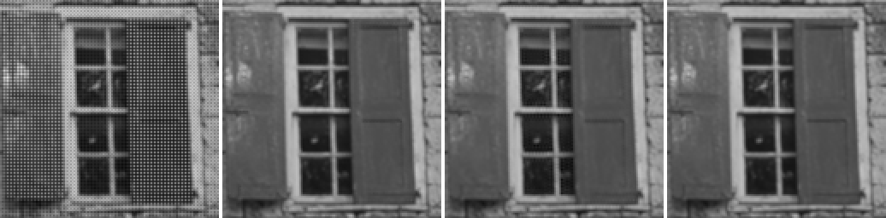

### kodim02

Mosaic · AHD (libraw) (48.68 dB) · Mimizan (49.35 dB) · ground truth — window at (219, 16)

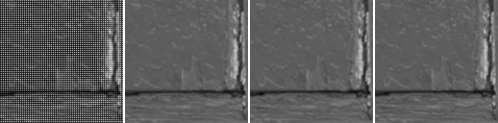

### kodim03

Mosaic · RCD (RawTherapee) (54.84 dB) · Mimizan (53.06 dB) · ground truth — window at (156, 96)

### kodim04

Mosaic · DCB (RawTherapee) (49.83 dB) · Mimizan (50.75 dB) · ground truth — window at (238, 20)

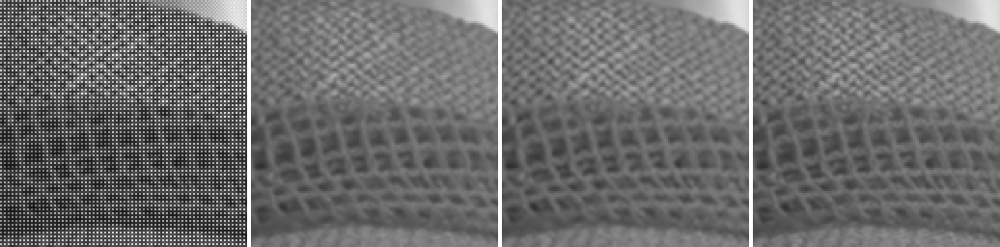

### kodim05

Mosaic · DCB (RawTherapee) (48.84 dB) · Mimizan (46.58 dB) · ground truth — window at (243, 200)

### kodim06

Mosaic · DCB (RawTherapee) (52.08 dB) · Mimizan (48.96 dB) · ground truth — window at (291, 212)

### kodim07

Mosaic · RCD (RawTherapee) (53.65 dB) · Mimizan (52.30 dB) · ground truth — window at (325, 158)

### kodim08

Mosaic · LMMSE (RawTherapee) (49.23 dB) · Mimizan (46.08 dB) · ground truth — window at (86, 239)

### kodim09

Mosaic · DCB (RawTherapee) (55.53 dB) · Mimizan (52.78 dB) · ground truth — window at (345, 398)

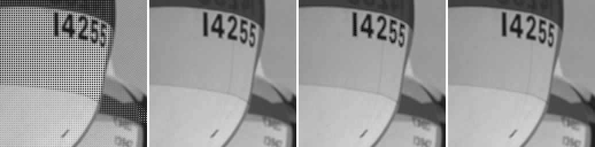

### kodim10

Mosaic · DCB (RawTherapee) (55.35 dB) · Mimizan (54.64 dB) · ground truth — window at (266, 517)

### kodim11

Mosaic · DCB (RawTherapee) (51.33 dB) · Mimizan (48.17 dB) · ground truth — window at (379, 188)

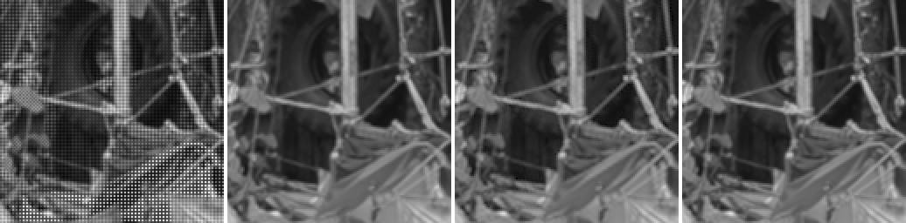

### kodim12

Mosaic · DCB (RawTherapee) (56.39 dB) · Mimizan (54.78 dB) · ground truth — window at (272, 138)

### kodim13

Mosaic · DCB (RawTherapee) (46.38 dB) · Mimizan (45.11 dB) · ground truth — window at (50, 249)

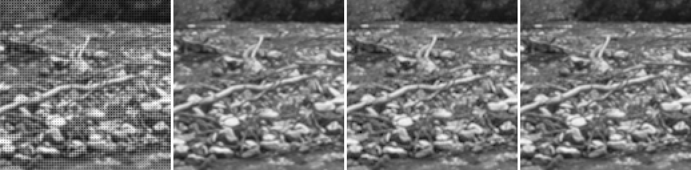

### kodim14

Mosaic · DCB (RawTherapee) (48.72 dB) · Mimizan (47.36 dB) · ground truth — window at (160, 168)

### kodim15

Mosaic · DCB (RawTherapee) (51.43 dB) · Mimizan (51.76 dB) · ground truth — window at (206, 284)

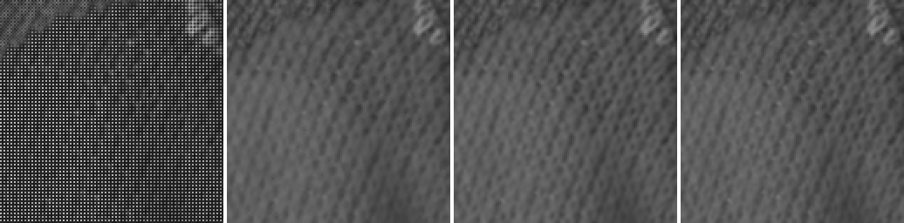

### kodim16

Mosaic · DCB (RawTherapee) (56.09 dB) · Mimizan (53.13 dB) · ground truth — window at (370, 203)

### kodim17

Mosaic · DCB (RawTherapee) (54.14 dB) · Mimizan (51.66 dB) · ground truth — window at (250, 89)

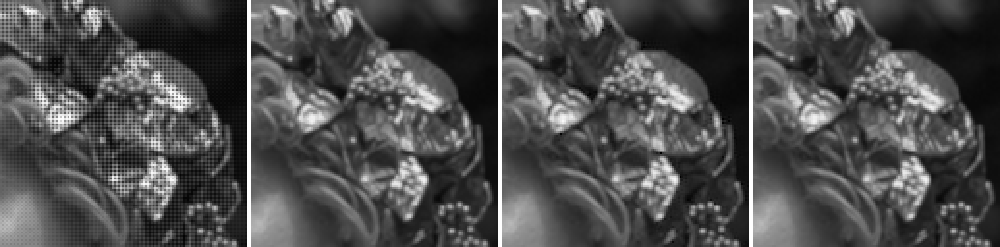

### kodim18

Mosaic · DCB (RawTherapee) (48.55 dB) · Mimizan (47.61 dB) · ground truth — window at (258, 266)

### kodim19

Mosaic · DCB (RawTherapee) (53.40 dB) · Mimizan (48.16 dB) · ground truth — window at (16, 389)

### kodim20

Mosaic · DCB (RawTherapee) (54.59 dB) · Mimizan (51.52 dB) · ground truth — window at (143, 166)

### kodim21

Mosaic · LMMSE (RawTherapee) (51.74 dB) · Mimizan (49.26 dB) · ground truth — window at (170, 264)

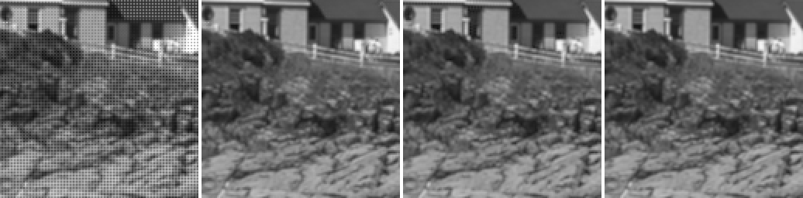

### kodim22

Mosaic · DCB (RawTherapee) (50.99 dB) · Mimizan (50.10 dB) · ground truth — window at (430, 134)

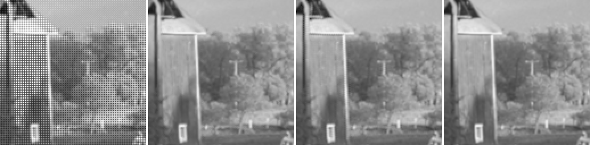

### kodim23

Mosaic · RCD (RawTherapee) (53.84 dB) · Mimizan (55.27 dB) · ground truth — window at (127, 173)

### kodim24

Mosaic · DCB (RawTherapee) (48.50 dB) · Mimizan (48.53 dB) · ground truth — window at (58, 16)

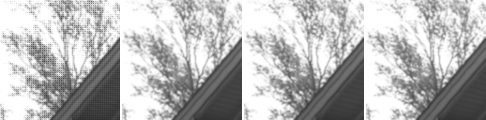

Kodak pictures: released by Eastman Kodak for unrestricted use; copies at <https://r0k.us/graphics/kodak/> and <https://github.com/lemire/kodakimagecollection>.
