# Kodak fake-Bayer benchmark

Generated by `mimizan bench kodak`. The 24 Kodak PhotoCD pictures (768×512, 8-bit sRGB, film scans without CFA artefacts) are linearised, sampled through an RGGB Bayer pattern and quantised to 16 bit. **Condition: pixel-sharp**, the pictures as they are, the convention of the demosaicing literature (colour edges one pixel wide, which no lens delivers). The identical mosaic goes to Mimizan and, as a DNG, to the external demosaicers. Their RGB output is reduced with the same weights as the ground truth, `(R + 2G + B)/4` (Mimizan's `Native` mix), so every number measures reconstruction of the luminance only: no tone curve, no sharpening, no noise reduction anywhere.

Metrics on sRGB-encoded 8-bit-scale values, 16 px border excluded: PSNR in dB and SSIM (Gaussian 11×11, σ = 1.5). Higher is better. The mosaic reaches Mimizan with a noise model of the 8-bit quantisation only (`σ ≈ 2.2·10⁻³·√s + 10⁻⁴`), so the block mask treats film grain as signal.

Converters:

- `dcraw_emu`: dcraw_emu: almost complete dcraw emulator
- `rawtherapee-cli`: RawTherapee, version 5.11, command line.

libraw: `dcraw_emu -4 -o 0 -r 1 1 1 1 -c 0 -H 0 -q N` (linear 16-bit, camera channels, unit balance). RawTherapee: `rawtherapee-cli -n -b16 -p <neutral profile with the demosaicer>`, sRGB transfer curve inverted on read. Both were verified to return the source channels unchanged on a smooth picture (see `docs/RESULTS.md`).

## PSNR (dB, luminance)

| Picture | Bilinear | VNG (libraw) | PPG (libraw) | AHD (libraw) | DCB (libraw) | DHT (libraw) | AAHD (libraw) | fast (RawTherapee) | VNG4 (RawTherapee) | AHD (RawTherapee) | EAHD (RawTherapee) | HPHD (RawTherapee) | DCB (RawTherapee) | LMMSE (RawTherapee) | IGV (RawTherapee) | AMaZE (RawTherapee) | RCD (RawTherapee) | Mimizan fixed | Mimizan block mask | Mimizan | Mimizan + reconstruct | computed |
|---|---|---|---|---|---|---|---|---|---|---|---|---|---|---|---|---|---|---|---|---|---|---|
| kodim01 | 28.85 | 34.30 | 34.58 | 35.29 | 32.81 | 35.59 | 35.73 | 33.65 | 31.76 | 35.58 | 35.72 | 37.70 | 36.66 | 41.43 | 40.47 | 38.38 | 35.01 | 32.81 | 33.22 | 33.76 | 40.21 | 79.5 % |
| kodim02 | 36.19 | 38.49 | 39.48 | 40.08 | 38.92 | 38.89 | 40.28 | 36.09 | 36.46 | 34.62 | 34.72 | 34.64 | 35.69 | 35.75 | 34.05 | 35.55 | 36.80 | 32.90 | 32.86 | 37.64 | **42.04** | 32.7 % |
| kodim03 | 37.28 | 41.69 | 41.46 | 42.75 | 40.29 | 41.06 | 43.54 | 40.63 | 40.60 | 43.47 | 43.58 | 44.22 | 43.96 | 46.74 | 42.57 | 45.13 | 42.92 | 37.98 | 37.72 | 40.24 | 44.58 | 24.5 % |
| kodim04 | 36.13 | 39.19 | 39.44 | 40.05 | 38.54 | 39.15 | 39.52 | 38.96 | 39.28 | 40.22 | 40.33 | 40.67 | 40.87 | 42.60 | 39.00 | 41.37 | 40.36 | 34.01 | 33.79 | 38.85 | 41.55 | 28.6 % |
| kodim05 | 28.23 | 34.49 | 34.16 | 35.70 | 31.86 | 33.83 | 33.80 | 33.03 | 32.84 | 35.64 | 35.78 | 36.84 | 36.92 | 41.16 | 37.27 | 38.00 | 35.49 | 31.47 | 31.60 | 32.70 | 39.59 | 56.9 % |
| kodim06 | 30.60 | 35.67 | 35.80 | 37.37 | 34.81 | 37.52 | 38.33 | 35.00 | 33.30 | 38.12 | 38.40 | 40.06 | 39.20 | 43.16 | 42.27 | 40.46 | 37.12 | 33.79 | 34.40 | 35.29 | 41.86 | 65.7 % |
| kodim07 | 35.71 | 41.13 | 41.59 | 42.32 | 39.43 | 41.81 | 42.13 | 40.91 | 40.30 | 42.87 | 43.02 | 43.67 | 43.78 | 45.27 | 42.57 | 44.59 | 42.83 | 37.30 | 36.26 | 38.93 | 44.63 | 29.0 % |
| kodim08 | 25.90 | 31.14 | 33.54 | 34.74 | 31.64 | 34.24 | 34.14 | 32.91 | 28.07 | 34.80 | 35.03 | 36.74 | 35.62 | 40.08 | 38.81 | 37.32 | 34.32 | 28.34 | 28.19 | 31.63 | 38.78 | 83.1 % |
| kodim09 | 34.47 | 40.53 | 41.17 | 42.40 | 39.41 | 42.45 | 42.44 | 40.23 | 38.21 | 42.54 | 42.60 | 43.97 | 43.44 | 46.98 | 44.02 | 44.42 | 42.06 | 38.01 | 38.45 | 39.91 | 45.05 | 44.3 % |
| kodim10 | 34.86 | 41.17 | 40.14 | 42.56 | 38.98 | 42.22 | 42.86 | 39.21 | 39.02 | 42.75 | 42.77 | 43.40 | 43.42 | 46.76 | 44.20 | 44.57 | 41.87 | 39.52 | 40.30 | 40.67 | 44.98 | 43.2 % |
| kodim11 | 31.44 | 36.58 | 36.40 | 37.45 | 34.98 | 37.17 | 37.11 | 35.59 | 34.40 | 37.61 | 37.73 | 39.01 | 38.55 | 43.75 | 39.06 | 39.46 | 37.36 | 32.76 | 32.80 | 34.68 | 41.38 | 62.5 % |
| kodim12 | 36.13 | 41.76 | 41.86 | 43.25 | 40.45 | 43.80 | 44.04 | 41.11 | 39.38 | 43.74 | 43.87 | 45.25 | 44.47 | 47.47 | 45.89 | 45.70 | 42.94 | 39.39 | 38.33 | 41.05 | 45.61 | 46.0 % |
| kodim13 | 26.26 | 31.30 | 29.92 | 30.80 | 28.32 | 30.84 | 30.95 | 29.19 | 29.84 | 31.15 | 31.41 | 33.60 | 32.54 | 37.72 | 36.35 | 33.86 | 30.69 | 29.31 | 31.01 | 29.28 | 36.45 | 84.7 % |
| kodim14 | 31.45 | 35.91 | 35.99 | 36.68 | 34.49 | 35.82 | 36.64 | 35.25 | 34.91 | 36.89 | 37.03 | 37.55 | 38.21 | 40.35 | 35.46 | 38.79 | 37.09 | 31.67 | 31.75 | 34.13 | 40.01 | 62.7 % |
| kodim15 | 35.44 | 39.88 | 39.03 | 39.76 | 37.77 | 38.51 | 39.83 | 38.31 | 38.78 | 39.76 | 39.93 | 40.39 | 41.03 | 43.97 | 38.38 | 41.42 | 39.40 | 34.24 | 34.37 | 38.33 | 42.25 | 29.8 % |
| kodim16 | 34.20 | 39.36 | 39.61 | 41.86 | 38.84 | 41.70 | 42.78 | 38.73 | 36.45 | 42.28 | 42.52 | 44.20 | 43.29 | 47.53 | 46.11 | 44.54 | 41.04 | 37.35 | 37.24 | 40.13 | 45.56 | 50.9 % |
| kodim17 | 34.27 | 39.56 | 38.87 | 39.58 | 36.89 | 39.24 | 39.46 | 37.90 | 38.16 | 39.75 | 39.89 | 41.60 | 41.26 | 45.45 | 42.27 | 42.01 | 39.79 | 36.71 | 36.49 | 37.28 | 43.20 | 33.2 % |
| kodim18 | 30.56 | 35.31 | 34.40 | 34.97 | 32.84 | 34.90 | 34.45 | 33.83 | 34.26 | 35.18 | 35.38 | 36.73 | 36.53 | 39.75 | 36.98 | 37.29 | 35.18 | 32.51 | 32.39 | 33.57 | 39.45 | 55.2 % |
| kodim19 | 30.64 | 35.41 | 38.06 | 38.64 | 36.46 | 39.12 | 38.31 | 37.56 | 32.62 | 39.38 | 39.62 | 41.31 | 40.68 | 44.64 | 42.30 | 41.67 | 38.95 | 32.74 | 31.45 | 35.11 | 41.94 | 53.3 % |
| kodim20 | 33.47 | 39.52 | 39.26 | 40.07 | 37.14 | 39.79 | 38.79 | 38.70 | 37.89 | 40.29 | 40.46 | 41.76 | 41.65 | 44.56 | 42.35 | 42.76 | 40.11 | 36.43 | 36.32 | 37.44 | 43.41 | 35.7 % |
| kodim21 | 30.93 | 36.39 | 35.98 | 36.89 | 34.36 | 37.23 | 36.94 | 35.19 | 33.85 | 36.72 | 36.84 | 37.83 | 38.20 | 42.96 | 38.21 | 38.82 | 36.59 | 33.44 | 33.06 | 34.59 | 41.23 | 53.8 % |
| kodim22 | 33.15 | 37.73 | 37.46 | 37.92 | 36.06 | 38.53 | 38.47 | 36.73 | 35.92 | 38.32 | 38.48 | 39.91 | 39.43 | 41.79 | 40.19 | 40.22 | 38.31 | 34.98 | 35.19 | 36.50 | 40.99 | 52.3 % |
| kodim23 | 37.01 | 42.10 | 42.96 | 43.58 | 40.82 | 41.76 | 41.19 | 41.49 | 40.83 | 43.00 | 43.11 | 42.67 | 43.99 | 45.61 | 40.99 | 44.33 | 43.46 | 39.80 | 39.95 | 42.05 | **45.68** | 22.1 % |
| kodim24 | 29.40 | 34.47 | 33.03 | 34.32 | 31.75 | 34.08 | 34.00 | 32.31 | 32.80 | 34.54 | 34.82 | 36.29 | 35.62 | 38.77 | 36.81 | 36.59 | 33.78 | 32.94 | 32.34 | 33.42 | 38.54 | 56.6 % |
| **mean (24)** | **32.61** | **37.63** | **37.67** | **38.71** | **36.16** | **38.30** | **38.57** | **36.77** | **35.83** | **38.72** | **38.88** | **40.00** | **39.79** | **43.09** | **40.27** | **40.72** | **38.48** | 34.60 | 34.56 | **36.55** | **42.04** | 49.4 % |

Bold in the two Mimizan columns: at least as good as the best external demosaicer on that picture. "computed" is the share of the picture the reconstruction step took over (mean β).

## SSIM (luminance)

| Picture | Bilinear | VNG (libraw) | PPG (libraw) | AHD (libraw) | DCB (libraw) | DHT (libraw) | AAHD (libraw) | fast (RawTherapee) | VNG4 (RawTherapee) | AHD (RawTherapee) | EAHD (RawTherapee) | HPHD (RawTherapee) | DCB (RawTherapee) | LMMSE (RawTherapee) | IGV (RawTherapee) | AMaZE (RawTherapee) | RCD (RawTherapee) | Mimizan fixed | Mimizan block mask | Mimizan | Mimizan + reconstruct |
|---|---|---|---|---|---|---|---|---|---|---|---|---|---|---|---|---|---|---|---|---|---|
| kodim01 | 0.8937 | 0.9711 | 0.9670 | 0.9729 | 0.9523 | 0.9760 | 0.9779 | 0.9573 | 0.9509 | 0.9743 | 0.9751 | 0.9846 | 0.9794 | 0.9930 | 0.9903 | 0.9861 | 0.9689 | 0.9568 | 0.9619 | 0.9661 | 0.9888 |
| kodim02 | 0.9412 | 0.9602 | 0.9692 | 0.9729 | 0.9668 | 0.9608 | 0.9724 | 0.9575 | 0.9661 | 0.9478 | 0.9496 | 0.9504 | 0.9581 | 0.9448 | 0.9423 | 0.9555 | 0.9648 | 0.8914 | 0.8908 | 0.9571 | 0.9770 |
| kodim03 | 0.9648 | 0.9872 | 0.9848 | 0.9889 | 0.9818 | 0.9822 | 0.9907 | 0.9818 | 0.9818 | 0.9901 | 0.9906 | 0.9922 | 0.9914 | 0.9949 | 0.9904 | 0.9929 | 0.9884 | 0.9759 | 0.9732 | 0.9845 | 0.9906 |
| kodim04 | 0.9461 | 0.9724 | 0.9711 | 0.9752 | 0.9660 | 0.9741 | 0.9764 | 0.9691 | 0.9740 | 0.9773 | 0.9778 | 0.9808 | 0.9800 | 0.9873 | 0.9748 | 0.9825 | 0.9759 | 0.9391 | 0.9383 | 0.9701 | 0.9797 |
| kodim05 | 0.9248 | 0.9811 | 0.9789 | 0.9842 | 0.9667 | 0.9812 | 0.9827 | 0.9722 | 0.9727 | 0.9845 | 0.9849 | 0.9882 | 0.9873 | 0.9944 | 0.9870 | 0.9900 | 0.9827 | 0.9527 | 0.9491 | 0.9721 | 0.9899 |
| kodim06 | 0.9176 | 0.9764 | 0.9745 | 0.9829 | 0.9695 | 0.9838 | 0.9871 | 0.9675 | 0.9575 | 0.9847 | 0.9852 | 0.9897 | 0.9879 | 0.9941 | 0.9924 | 0.9905 | 0.9800 | 0.9674 | 0.9724 | 0.9769 | 0.9911 |
| kodim07 | 0.9749 | 0.9908 | 0.9900 | 0.9912 | 0.9868 | 0.9907 | 0.9919 | 0.9887 | 0.9891 | 0.9919 | 0.9922 | 0.9931 | 0.9934 | 0.9951 | 0.9908 | 0.9941 | 0.9919 | 0.9794 | 0.9765 | 0.9875 | 0.9931 |
| kodim08 | 0.9002 | 0.9717 | 0.9743 | 0.9800 | 0.9643 | 0.9805 | 0.9818 | 0.9698 | 0.9438 | 0.9802 | 0.9809 | 0.9873 | 0.9836 | 0.9934 | 0.9915 | 0.9878 | 0.9771 | 0.9451 | 0.9441 | 0.9687 | 0.9897 |
| kodim09 | 0.9576 | 0.9867 | 0.9813 | 0.9844 | 0.9765 | 0.9860 | 0.9869 | 0.9785 | 0.9796 | 0.9846 | 0.9851 | 0.9896 | 0.9880 | 0.9933 | 0.9916 | 0.9899 | 0.9834 | 0.9818 | 0.9846 | 0.9836 | 0.9886 |
| kodim10 | 0.9581 | 0.9881 | 0.9838 | 0.9867 | 0.9789 | 0.9881 | 0.9888 | 0.9808 | 0.9815 | 0.9870 | 0.9873 | 0.9907 | 0.9894 | 0.9940 | 0.9923 | 0.9913 | 0.9856 | 0.9832 | 0.9852 | 0.9848 | 0.9897 |
| kodim11 | 0.9276 | 0.9776 | 0.9759 | 0.9820 | 0.9695 | 0.9835 | 0.9842 | 0.9698 | 0.9615 | 0.9828 | 0.9832 | 0.9870 | 0.9860 | 0.9939 | 0.9869 | 0.9884 | 0.9801 | 0.9449 | 0.9480 | 0.9701 | 0.9888 |
| kodim12 | 0.9529 | 0.9851 | 0.9835 | 0.9876 | 0.9794 | 0.9889 | 0.9902 | 0.9792 | 0.9738 | 0.9884 | 0.9886 | 0.9920 | 0.9903 | 0.9945 | 0.9928 | 0.9924 | 0.9861 | 0.9783 | 0.9705 | 0.9840 | 0.9905 |
| kodim13 | 0.8719 | 0.9634 | 0.9450 | 0.9531 | 0.9233 | 0.9605 | 0.9603 | 0.9322 | 0.9498 | 0.9578 | 0.9599 | 0.9774 | 0.9701 | 0.9906 | 0.9874 | 0.9775 | 0.9521 | 0.9477 | 0.9587 | 0.9451 | 0.9841 |
| kodim14 | 0.9303 | 0.9789 | 0.9743 | 0.9793 | 0.9646 | 0.9771 | 0.9821 | 0.9678 | 0.9705 | 0.9789 | 0.9797 | 0.9828 | 0.9841 | 0.9908 | 0.9773 | 0.9867 | 0.9784 | 0.9557 | 0.9600 | 0.9715 | 0.9884 |
| kodim15 | 0.9553 | 0.9797 | 0.9748 | 0.9787 | 0.9708 | 0.9717 | 0.9798 | 0.9709 | 0.9750 | 0.9789 | 0.9798 | 0.9814 | 0.9822 | 0.9903 | 0.9686 | 0.9842 | 0.9755 | 0.9396 | 0.9402 | 0.9750 | 0.9836 |
| kodim16 | 0.9337 | 0.9813 | 0.9803 | 0.9876 | 0.9767 | 0.9874 | 0.9904 | 0.9749 | 0.9625 | 0.9881 | 0.9886 | 0.9923 | 0.9905 | 0.9956 | 0.9946 | 0.9926 | 0.9843 | 0.9750 | 0.9729 | 0.9848 | 0.9929 |
| kodim17 | 0.9585 | 0.9883 | 0.9832 | 0.9858 | 0.9764 | 0.9872 | 0.9878 | 0.9798 | 0.9840 | 0.9862 | 0.9865 | 0.9903 | 0.9893 | 0.9946 | 0.9921 | 0.9907 | 0.9850 | 0.9799 | 0.9786 | 0.9826 | 0.9900 |
| kodim18 | 0.9282 | 0.9765 | 0.9679 | 0.9714 | 0.9571 | 0.9756 | 0.9745 | 0.9623 | 0.9702 | 0.9727 | 0.9736 | 0.9800 | 0.9801 | 0.9888 | 0.9780 | 0.9829 | 0.9730 | 0.9538 | 0.9525 | 0.9672 | 0.9845 |
| kodim19 | 0.9297 | 0.9768 | 0.9736 | 0.9767 | 0.9656 | 0.9811 | 0.9801 | 0.9690 | 0.9614 | 0.9784 | 0.9797 | 0.9862 | 0.9848 | 0.9932 | 0.9891 | 0.9868 | 0.9766 | 0.9671 | 0.9579 | 0.9719 | 0.9870 |
| kodim20 | 0.9589 | 0.9855 | 0.9805 | 0.9826 | 0.9753 | 0.9837 | 0.9830 | 0.9785 | 0.9808 | 0.9839 | 0.9845 | 0.9871 | 0.9877 | 0.9902 | 0.9865 | 0.9896 | 0.9832 | 0.9711 | 0.9699 | 0.9795 | 0.9886 |
| kodim21 | 0.9388 | 0.9819 | 0.9756 | 0.9793 | 0.9674 | 0.9814 | 0.9819 | 0.9709 | 0.9709 | 0.9790 | 0.9796 | 0.9843 | 0.9843 | 0.9920 | 0.9859 | 0.9862 | 0.9778 | 0.9683 | 0.9690 | 0.9744 | 0.9878 |
| kodim22 | 0.9350 | 0.9770 | 0.9709 | 0.9741 | 0.9620 | 0.9783 | 0.9780 | 0.9653 | 0.9688 | 0.9760 | 0.9768 | 0.9831 | 0.9817 | 0.9884 | 0.9828 | 0.9844 | 0.9748 | 0.9651 | 0.9637 | 0.9724 | 0.9848 |
| kodim23 | 0.9759 | 0.9874 | 0.9862 | 0.9871 | 0.9839 | 0.9782 | 0.9876 | 0.9848 | 0.9854 | 0.9872 | 0.9875 | 0.9879 | 0.9890 | 0.9929 | 0.9835 | 0.9900 | 0.9879 | 0.9767 | 0.9771 | 0.9864 | 0.9891 |
| kodim24 | 0.9334 | 0.9821 | 0.9766 | 0.9810 | 0.9664 | 0.9833 | 0.9833 | 0.9708 | 0.9722 | 0.9819 | 0.9826 | 0.9886 | 0.9858 | 0.9932 | 0.9898 | 0.9893 | 0.9795 | 0.9712 | 0.9673 | 0.9770 | 0.9904 |
| **mean (24)** | **0.9379** | **0.9795** | **0.9760** | **0.9802** | **0.9687** | **0.9801** | **0.9825** | **0.9708** | **0.9702** | **0.9801** | **0.9808** | **0.9853** | **0.9843** | **0.9906** | **0.9849** | **0.9868** | **0.9789** | 0.9611 | 0.9609 | **0.9747** | **0.9879** |

Mimizan is at or above the best external demosaicer on 0 of 24 pictures (PSNR); with the reconstruction step on 2 of 24. "Mimizan" is the default pipeline (`--mask dubois`: pixel-adaptive weighting of the two C2 copies and of two direction-dependent C1 bands, elongated pass bands). "Mimizan fixed" is the same separation with square 0.15 c/px bands and the two C2 copies averaged (`--mask off`); "Mimizan block mask" is the fixed separation with the 64 px block-spectrum mask (`--mask adaptive`). The differences between the three columns are what the adaptive steps contribute. "Mimizan + reconstruct" is the default pipeline with the optional nonlinear step (`--reconstruct`, off by default): where the linear luminance still carries energy near the carriers, a per-pixel direction decision on the colour differences replaces the filter output. Those pixels are computed, not measured; the "computed" column says how many.

## Crops

Each strip: **mosaic** as the sensor records it (grey, CFA pattern visible) · **best external demosaicer → mono** · **Mimizan** · **ground truth**. 128×128 px window at 2× (nearest neighbour), chosen automatically as the region with the largest combined error of the two estimates, i.e. the hardest spot for both, not a hand-picked win.

### kodim01

Mosaic · LMMSE (RawTherapee) (41.43 dB) · Mimizan (33.76 dB) · ground truth — window at (427, 133)

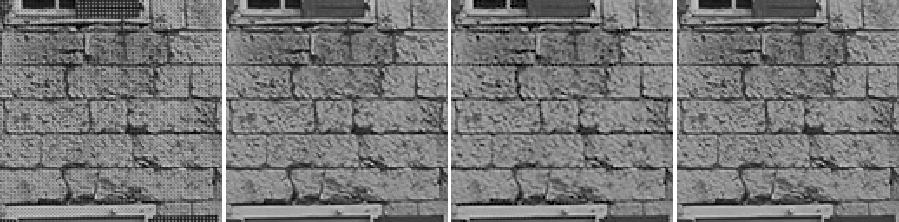

### kodim02

Mosaic · AAHD (libraw) (40.28 dB) · Mimizan (37.64 dB) · ground truth — window at (224, 91)

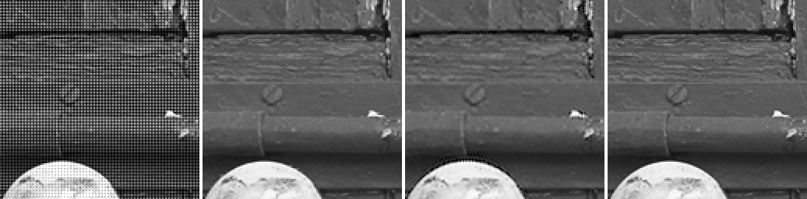

### kodim03

Mosaic · LMMSE (RawTherapee) (46.74 dB) · Mimizan (40.24 dB) · ground truth — window at (163, 76)

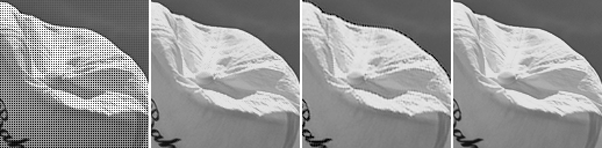

### kodim04

Mosaic · LMMSE (RawTherapee) (42.60 dB) · Mimizan (38.85 dB) · ground truth — window at (246, 34)

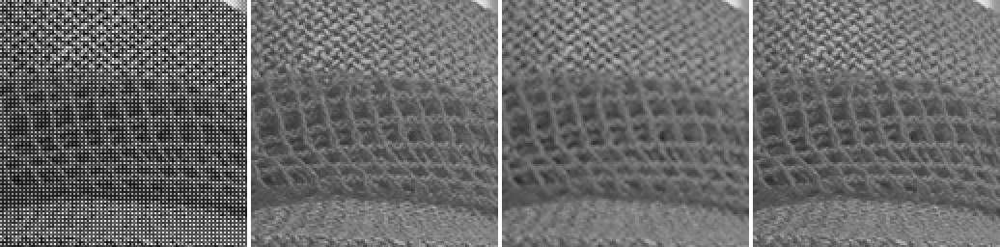

### kodim05

Mosaic · LMMSE (RawTherapee) (41.16 dB) · Mimizan (32.70 dB) · ground truth — window at (445, 326)

### kodim06

Mosaic · LMMSE (RawTherapee) (43.16 dB) · Mimizan (35.29 dB) · ground truth — window at (245, 62)

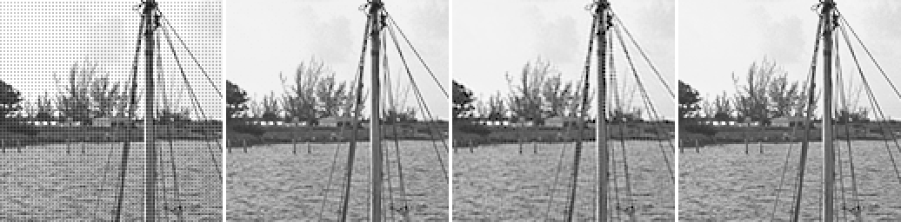

### kodim07

Mosaic · LMMSE (RawTherapee) (45.27 dB) · Mimizan (38.93 dB) · ground truth — window at (340, 154)

### kodim08

Mosaic · LMMSE (RawTherapee) (40.08 dB) · Mimizan (31.63 dB) · ground truth — window at (104, 339)

### kodim09

Mosaic · LMMSE (RawTherapee) (46.98 dB) · Mimizan (39.91 dB) · ground truth — window at (114, 543)

### kodim10

Mosaic · LMMSE (RawTherapee) (46.76 dB) · Mimizan (40.67 dB) · ground truth — window at (354, 513)

### kodim11

Mosaic · LMMSE (RawTherapee) (43.75 dB) · Mimizan (34.68 dB) · ground truth — window at (370, 215)

### kodim12

Mosaic · LMMSE (RawTherapee) (47.47 dB) · Mimizan (41.05 dB) · ground truth — window at (276, 136)

### kodim13

Mosaic · LMMSE (RawTherapee) (37.72 dB) · Mimizan (29.28 dB) · ground truth — window at (488, 225)

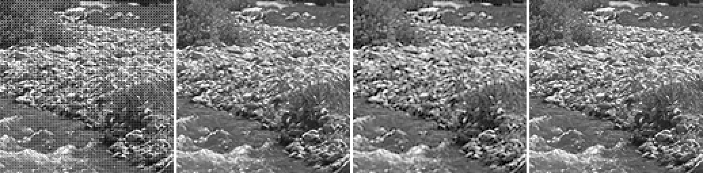

### kodim14

Mosaic · LMMSE (RawTherapee) (40.35 dB) · Mimizan (34.13 dB) · ground truth — window at (169, 164)

### kodim15

Mosaic · LMMSE (RawTherapee) (43.97 dB) · Mimizan (38.33 dB) · ground truth — window at (230, 198)

### kodim16

Mosaic · LMMSE (RawTherapee) (47.53 dB) · Mimizan (40.13 dB) · ground truth — window at (366, 202)

### kodim17

Mosaic · LMMSE (RawTherapee) (45.45 dB) · Mimizan (37.28 dB) · ground truth — window at (246, 88)

### kodim18

Mosaic · LMMSE (RawTherapee) (39.75 dB) · Mimizan (33.57 dB) · ground truth — window at (195, 267)

### kodim19

Mosaic · LMMSE (RawTherapee) (44.64 dB) · Mimizan (35.11 dB) · ground truth — window at (22, 445)

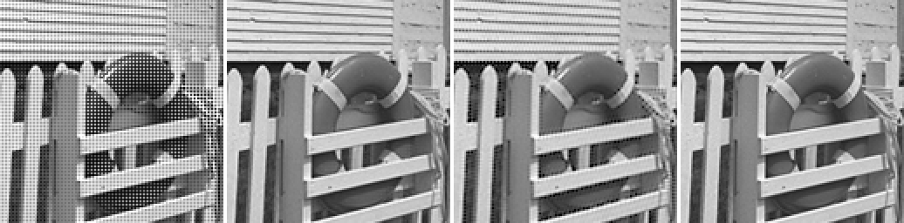

### kodim20

Mosaic · LMMSE (RawTherapee) (44.56 dB) · Mimizan (37.44 dB) · ground truth — window at (246, 224)

### kodim21

Mosaic · LMMSE (RawTherapee) (42.96 dB) · Mimizan (34.59 dB) · ground truth — window at (261, 274)

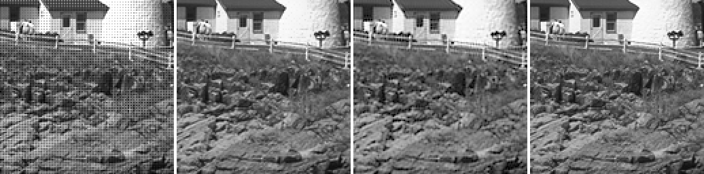

### kodim22

Mosaic · LMMSE (RawTherapee) (41.79 dB) · Mimizan (36.50 dB) · ground truth — window at (429, 130)

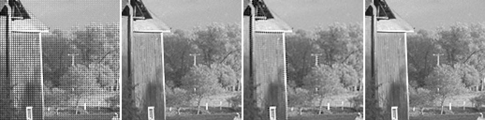

### kodim23

Mosaic · LMMSE (RawTherapee) (45.61 dB) · Mimizan (42.05 dB) · ground truth — window at (125, 183)

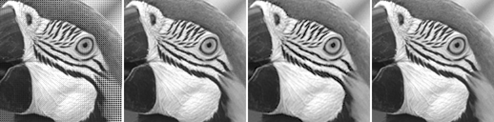

### kodim24

Mosaic · LMMSE (RawTherapee) (38.77 dB) · Mimizan (33.42 dB) · ground truth — window at (57, 16)

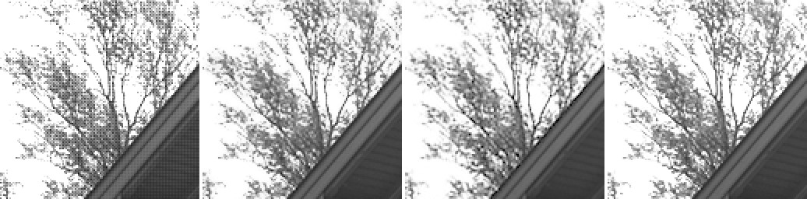

Kodak pictures: released by Eastman Kodak for unrestricted use; copies at <https://r0k.us/graphics/kodak/> and <https://github.com/lemire/kodakimagecollection>.
