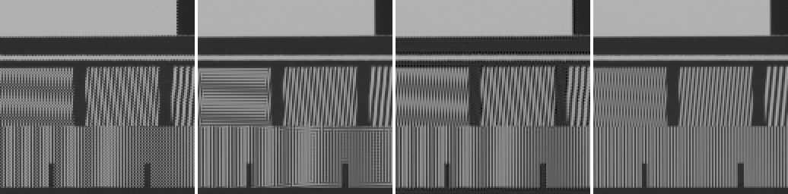
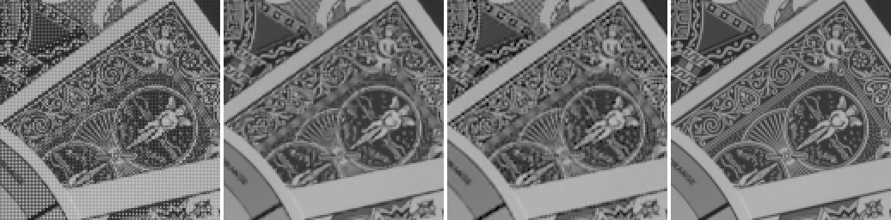
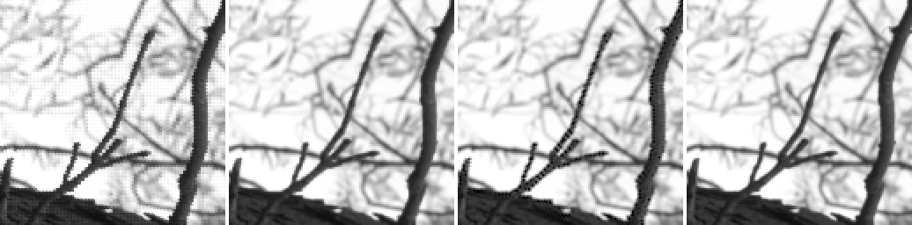
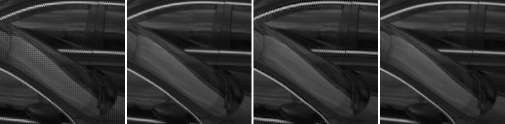

# Fake-Bayer benchmark on real RAW files

Generated by `mimizan bench kodak --raw`. Each RAW is decoded and channel-balanced as the pipeline does it, then every 2×2 CFA cell is binned to one RGB pixel (R and B measured, G the mean of the two measured greens): a half-size picture in which every channel of every pixel was measured, from the real lens, the real sensor and its real noise. That picture is the ground truth and is sampled through an RGGB Bayer pattern again, quantised to 16 bit. Relative to the new pixel grid the content is about twice as sharp as the camera saw it, so this sits between the pixel-sharp and the band-limited Kodak conditions, with real noise added. The identical mosaic goes to Mimizan and, as a DNG, to the external demosaicers. Their RGB output is reduced with the same weights as the ground truth, `(R + 2G + B)/4` (Mimizan's `Native` mix), so every number measures reconstruction of the luminance only: no tone curve, no sharpening, no noise reduction anywhere.

Metrics on sRGB-encoded 8-bit-scale values, 16 px border excluded: PSNR in dB and SSIM (Gaussian 11×11, σ = 1.5). Higher is better. The mosaic reaches Mimizan with the camera's noise model, so the block mask works as in production.

Converters:

- `dcraw_emu`: dcraw_emu: almost complete dcraw emulator
- `rawtherapee-cli`: RawTherapee, version 5.11, command line.

libraw: `dcraw_emu -4 -o 0 -r 1 1 1 1 -c 0 -H 0 -q N` (linear 16-bit, camera channels, unit balance). RawTherapee: `rawtherapee-cli -n -b16 -p <neutral profile with the demosaicer>`, sRGB transfer curve inverted on read. Both were verified to return the source channels unchanged on a smooth picture (see `docs/RESULTS.md`).

## PSNR (dB, luminance)

| Picture | Bilinear | AHD (libraw) | DHT (libraw) | AMaZE (RawTherapee) | RCD (RawTherapee) | Mimizan fixed | Mimizan block mask | Mimizan | Mimizan + reconstruct | computed |
|---|---|---|---|---|---|---|---|---|---|---|
| NikonZF | 33.58 | 38.00 | 37.22 | 38.62 | 38.90 | 33.53 | 33.76 | 36.31 | 37.91 | 15.7 % |
| NikonZF_2 | 34.67 | 39.14 | 38.53 | 39.87 | 40.08 | 34.30 | 34.19 | 37.02 | 39.02 | 13.5 % |
| nikon_zf_01 | 37.20 | 41.17 | 40.60 | 41.80 | 43.08 | 38.00 | 37.33 | 41.98 | 42.36 | 5.9 % |
| nikon_zf_27 | 43.65 | 48.06 | 47.95 | 48.13 | 49.18 | 43.04 | 43.44 | 46.23 | 47.39 | 6.2 % |
| **mean (4)** | **37.28** | **41.59** | **41.08** | **42.10** | **42.81** | 37.22 | 37.18 | **40.38** | **41.67** | 10.3 % |

Bold in the two Mimizan columns: at least as good as the best external demosaicer on that picture. "computed" is the share of the picture the reconstruction step took over (mean β).

## SSIM (luminance)

| Picture | Bilinear | AHD (libraw) | DHT (libraw) | AMaZE (RawTherapee) | RCD (RawTherapee) | Mimizan fixed | Mimizan block mask | Mimizan | Mimizan + reconstruct |
|---|---|---|---|---|---|---|---|---|---|
| NikonZF | 0.9689 | 0.9845 | 0.9831 | 0.9867 | 0.9867 | 0.9572 | 0.9597 | 0.9806 | 0.9845 |
| NikonZF_2 | 0.9707 | 0.9852 | 0.9839 | 0.9871 | 0.9873 | 0.9575 | 0.9583 | 0.9805 | 0.9849 |
| nikon_zf_01 | 0.9697 | 0.9829 | 0.9829 | 0.9857 | 0.9864 | 0.9710 | 0.9683 | 0.9842 | 0.9848 |
| nikon_zf_27 | 0.9892 | 0.9952 | 0.9949 | 0.9952 | 0.9961 | 0.9865 | 0.9874 | 0.9938 | 0.9945 |
| **mean (4)** | **0.9746** | **0.9870** | **0.9862** | **0.9887** | **0.9891** | 0.9680 | 0.9685 | **0.9848** | **0.9872** |

Mimizan is at or above the best external demosaicer on 0 of 4 pictures (PSNR); with the reconstruction step on 0 of 4. "Mimizan" is the default pipeline (`--mask dubois`: pixel-adaptive weighting of the two C2 copies and of two direction-dependent C1 bands, elongated pass bands). "Mimizan fixed" is the same separation with square 0.15 c/px bands and the two C2 copies averaged (`--mask off`); "Mimizan block mask" is the fixed separation with the 64 px block-spectrum mask (`--mask adaptive`). The differences between the three columns are what the adaptive steps contribute. "Mimizan + reconstruct" is the default pipeline with the optional nonlinear step (`--reconstruct`, off by default): where the linear luminance still carries energy near the carriers, a per-pixel direction decision on the colour differences replaces the filter output. Those pixels are computed, not measured; the "computed" column says how many.

## Crops

Each strip: **mosaic** as the sensor records it (grey, CFA pattern visible) · **best external demosaicer → mono** · **Mimizan** · **ground truth**. 128×128 px window at 2× (nearest neighbour), chosen automatically as the region with the largest combined error of the two estimates, i.e. the hardest spot for both, not a hand-picked win.

### NikonZF

Mosaic · RCD (RawTherapee) (38.90 dB) · Mimizan (36.31 dB) · ground truth — window at (1563, 1308)

### NikonZF_2

Mosaic · RCD (RawTherapee) (40.08 dB) · Mimizan (37.02 dB) · ground truth — window at (2077, 178)

### nikon_zf_01

Mosaic · RCD (RawTherapee) (43.08 dB) · Mimizan (41.98 dB) · ground truth — window at (2139, 698)

### nikon_zf_27

Mosaic · RCD (RawTherapee) (49.18 dB) · Mimizan (46.23 dB) · ground truth — window at (2395, 1822)

Kodak pictures: released by Eastman Kodak for unrestricted use; copies at <https://r0k.us/graphics/kodak/> and <https://github.com/lemire/kodakimagecollection>.
